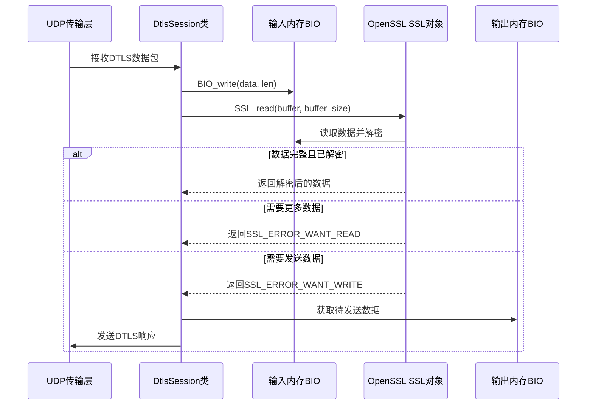
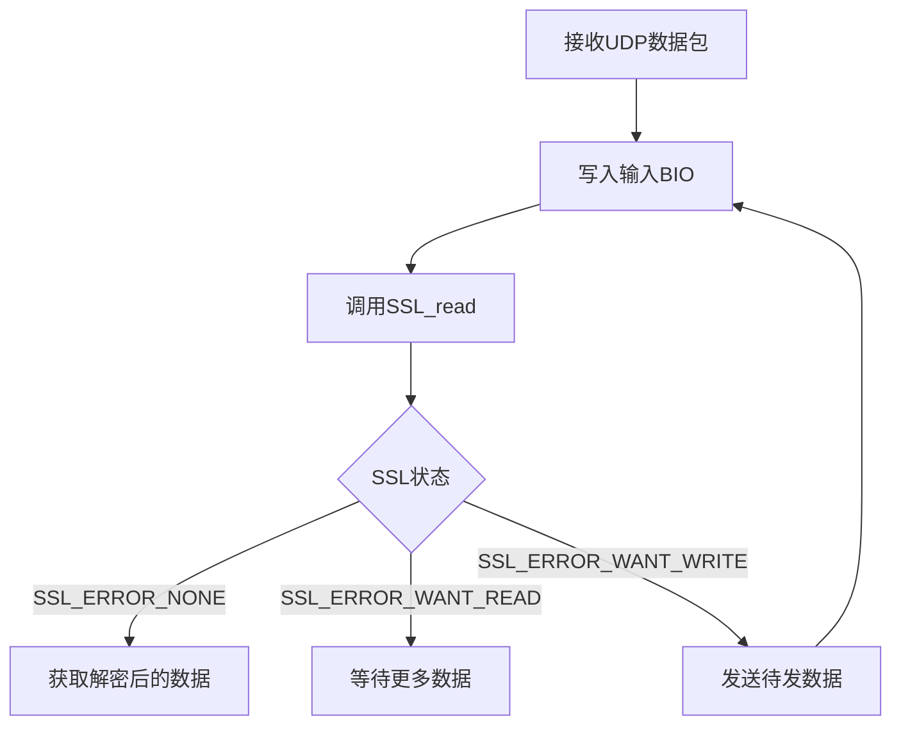
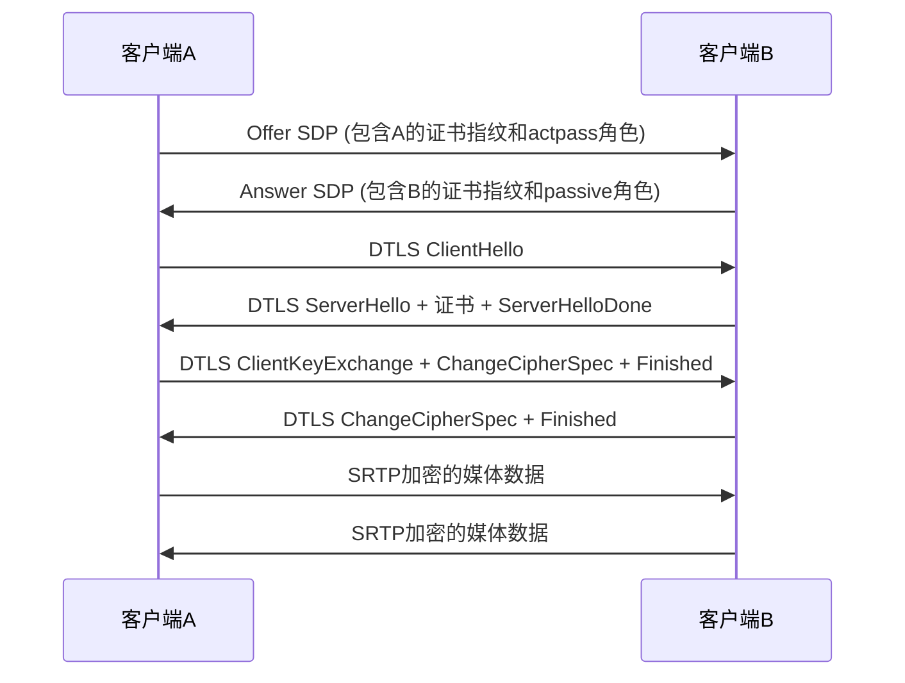

# DTLS协议协商实现分析

## 1. DTLS实现概述

项目使用**OpenSSL库**实现DTLS协议协商，主要用于WebRTC中的DTLS-SRTP握手过程，目的是安全地协商SRTP加密参数和密钥。

## 2. DTLS数据处理机制

### 2.1 与SSL/TCP的对比

| 特性 | SSL/TCP | DTLS/UDP |
|------|---------|----------|
| 传输层 | TCP（可靠） | UDP（不可靠） |
| 数据接口 | `SSL_read()`/`SSL_write()` | 基于内存BIO的自定义处理 |
| 握手过程 | 连续的 | 数据包化的，带重传机制 |
| 消息边界 | 流数据，无边界 | 基于UDP包的消息边界 |

### 2.2 DTLS数据处理流程



## 3. 核心实现组件

### 3.1 内存BIO机制

项目使用**内存BIO**（BIO_s_mem）而不是直接的网络BIO，这样可以更灵活地控制数据流向：

```cpp
// 创建内存BIO
ssl_bio_from_network_ = BIO_new(BIO_s_mem());  // 输入BIO
ssl_bio_to_network_ = BIO_new(BIO_s_mem());    // 输出BIO

// 将BIO与SSL对象关联
SSL_set_bio(ssl_, ssl_bio_from_network_, ssl_bio_to_network_);
```

### 3.2 数据处理接口

**接收DTLS数据**：
```cpp
int DtlsSession::OnHandleDtlsData(const uint8_t* data, size_t len, UdpTuple addr) {
    // 1. 将接收到的数据写入输入BIO
    int written = BIO_write(ssl_bio_from_network_, data, static_cast<int>(len));
    
    // 2. 尝试从SSL读取解密后的数据
    int read = SSL_read(ssl_, ssl_read_buffer_, SslReadBufferSize);
    
    // 3. 处理SSL返回状态
    return CheckStatus(read) ? 0 : -1;
}
```

**发送DTLS数据**：
```cpp
void DtlsSession::SendDtlsMemData() {
    // 从输出BIO获取数据
    char* data = nullptr;
    int64_t read = BIO_get_mem_data(ssl_bio_to_network_, &data);
    
    if (read > 0) {
        // 通过回调发送数据
        transport_->OnDtlsTransportSendData(
            reinterpret_cast<uint8_t*>(data), 
            static_cast<size_t>(read), 
            dtls_remote_addr_);
        
        // 重置输出BIO
        BIO_reset(ssl_bio_to_network_);
    }
}
```

## 4. DTLS协议协商流程

### 4.1 初始化阶段

```cpp
int DtlsSession::Init(const std::string& cert_file, const std::string& key_file) {
    // 1. 加载证书和私钥
    certificate_ = PEM_read_bio_X509(bio, nullptr, nullptr, nullptr);
    private_key_ = PEM_read_bio_PrivateKey(bio, nullptr, nullptr, nullptr);
    
    // 2. 创建SSL上下文
    ssl_ctx_ = SSL_CTX_new(DTLS_method());
    
    // 3. 配置SSL参数
    SSL_CTX_use_certificate(ssl_ctx_, certificate_);
    SSL_CTX_use_PrivateKey(ssl_ctx_, private_key_);
    SSL_CTX_set_tlsext_use_srtp(ssl_ctx_, "SRTP_AEAD_AES_256_GCM:...");
    
    // 4. 生成证书指纹 (通过SDP传递)
    X509_digest(certificate_, hashFunction, binaryFingerprint, &size);
}
```

### 4.2 会话创建

```cpp
int DtlsSession::InitSession() {
    // 1. 创建SSL对象
    ssl_ = SSL_new(ssl_ctx_);
    
    // 2. 设置BIO
    ssl_bio_from_network_ = BIO_new(BIO_s_mem());
    ssl_bio_to_network_ = BIO_new(BIO_s_mem());
    SSL_set_bio(ssl_, ssl_bio_from_network_, ssl_bio_to_network_);
    
    // 3. 配置DTLS参数
    SSL_set_mtu(ssl_, DTLS_MTU);
    DTLS_set_link_mtu(ssl_, DTLS_MTU);
    DTLS_set_timer_cb(ssl_, OnSslDtlsTimer);
}
```

### 4.3 握手过程

```cpp
int DtlsSession::Run() {
    if (role_ == Role::ROLE_CLIENT) {
        SSL_set_connect_state(ssl_);
    } else if (role_ == Role::ROLE_SERVER) {
        SSL_set_accept_state(ssl_);
    }
    
    // 开始握手
    SSL_do_handshake(ssl_);
    
    // 发送握手消息
    SendDtlsMemData();
}
```

### 4.4 握手完成处理

```cpp
void DtlsSession::OnSslInfo(int where, int ret) {
    if ((where & SSL_CB_HANDSHAKE_DONE) != 0) {
        handshake_done_ = true;
        ProcessHandshake();
    }
}

bool DtlsSession::ProcessHandshake() {
    // 1. 验证远程证书指纹
    GenRemoteCertByRemoteFingerprint();
    
    // 2. 获取协商的SRTP加密套件
    auto srtpCryptoSuite = GenSslSrtpCryptoSuite();
    
    // 3. 生成SRTP密钥
    GenSrtpKeys(srtpCryptoSuite);
}
```

## 5. SRTP密钥生成过程

### 5.1 导出密钥材料

```cpp
void DtlsSession::GenSrtpKeys(SRtpSessionCryptoSuite crypto_suite) {
    // 1. 从SSL会话导出密钥材料
    SSL_export_keying_material(
        ssl_, srtpMaterial, srtpMasterLength * 2, 
        "EXTRACTOR-dtls_srtp", 19, nullptr, 0, 0);
    
    // 2. 根据角色分配本地和远程密钥
    if (role_ == Role::ROLE_SERVER) {
        srtpRemoteKey = srtpMaterial;
        srtpLocalKey = srtpRemoteKey + srtpKeyLength;
        srtpRemoteSalt = srtpLocalKey + srtpKeyLength;
        srtpLocalSalt = srtpRemoteSalt + srtpSaltLength;
    } else {
        // 客户端角色的密钥分配...
    }
    
    // 3. 通知上层获取到的SRTP密钥
    transport_->OnDtlsTransportConnected(
        this, crypto_suite, 
        srtpLocalMasterKey, srtpMasterLength,
        srtpRemoteMasterKey, srtpMasterLength,
        remote_cert_);
}
```

## 6. 数据解密机制

### 6.1 解密流程



### 6.2 解密关键代码

```cpp
int DtlsSession::OnHandleDtlsData(const uint8_t* data, size_t len, UdpTuple addr) {
    // 将原始DTLS数据写入输入BIO
    BIO_write(ssl_bio_from_network_, data, static_cast<int>(len));
    
    // 尝试读取解密后的数据
    int read = SSL_read(ssl_, ssl_read_buffer_, SslReadBufferSize);
    
    // 检查SSL状态
    if (CheckStatus(read)) {
        if (read > 0) {
            // 成功读取到解密后的数据，长度为read
            // 数据存储在ssl_read_buffer_中
        }
        return 0;
    }
    return -1;
}
```

## 7. DTLS加密参数与SDP的关系

### 7.1 DTLS加密参数通过SDP传递的机制

在WebRTC中，DTLS的加密密钥**不是**直接通过SDP传递的。SDP只传递用于DTLS握手所需的公开参数，而实际的加密密钥是在DTLS握手中安全协商的。

### 7.2 通过SDP传递的加密相关参数

SDP中包含以下与DTLS加密相关的参数：

#### 7.2.1 证书指纹 (a=fingerprint)
```
a=fingerprint:sha-256 77:B0:05:EC:26:1B:9F:85:B7:83:69:0A:57:2F:55:81:9C:60:1A:F7:A6:54:CC:A7:DF:16:61:E1:F8:72:39:F0
```
- **用途**：用于验证远程DTLS证书的身份
- **生成方式**：通过`X509_digest()`函数生成证书的哈希值
- **重要性**：防止中间人攻击，确保连接的安全

#### 7.2.2 DTLS角色 (a=setup)
```
// Offer中
a=setup:actpass

// Answer中
a=setup:passive
```
- **用途**：指定DTLS连接的角色（主动/被动）
- **选项**：
  - `actpass`：主动/被动模式（Offer方使用）
  - `passive`：被动模式（Answer方使用）
  - `active`：主动模式
- **作用**：确定哪一方发起DTLS握手

#### 7.2.3 SRTP加密套件 (隐含在a=rtcp-fb中)
```
a=rtcp-fb:96 goog-remb
a=rtcp-fb:96 transport-cc
a=rtcp-fb:96 ccm fir
a=rtcp-fb:96 nack
a=rtcp-fb:96 nack pli
```
- **用途**：表示支持SRTP加密（通过RTCP反馈机制暗示）
- **实际协商**：具体的SRTP加密套件在DTLS握手中协商

#### 7.2.4 媒体传输协议 (m=行中的proto字段)
```
m=video 9 UDP/TLS/RTP/SAVPF 96 97 103 104 107 108 109 114 115 116 117 118 39 40 45 46 98 99 100 101 119 120 123 124 125
```
- **用途**：指定使用DTLS加密的RTP传输（`UDP/TLS/RTP/SAVPF`）
- **说明**：
  - `UDP`：使用UDP传输
  - `TLS`：使用DTLS加密
  - `RTP`：使用RTP协议
  - `SAVPF`：安全的音频/视频配置文件

### 7.3 DTLS密钥的协商过程

1. **SDP交换**：双方交换包含DTLS证书指纹和角色的SDP
2. **DTLS握手**：使用OpenSSL进行DTLS握手
3. **密钥导出**：从DTLS握手结果中导出SRTP密钥材料
4. **SRTP密钥生成**：使用导出的密钥材料生成SRTP加密密钥



### 7.4 安全保障机制

- **证书验证**：使用SDP中的指纹验证远程证书
- **密钥协商**：通过DTLS握手安全地协商加密密钥
- **前向保密**：每次会话生成新的密钥，即使长期私钥泄露也不会影响过去的通信
- **完整性保护**：使用MAC算法保护数据完整性

## 8. 关键技术点总结

1. **内存BIO设计**：使用内存BIO代替直接网络BIO，更灵活地控制数据流向
2. **状态机处理**：通过SSL返回的状态码处理各种DTLS事件
3. **握手管理**：实现了完整的DTLS握手过程，包括重传和超时处理
4. **密钥导出**：安全地从SSL会话中导出SRTP密钥材料
5. **SDP参数传递**：通过SDP传递DTLS证书指纹、角色等公开参数
6. **回调机制**：通过回调处理DTLS事件（如握手完成、数据发送等）

## 9. 与用户问题的对应

### 9.1 "类似tcp的SSL_read这种接口"

项目实现了**类似但不完全相同**的接口：
- 不是直接的`SSL_read(socket, ...)`
- 而是先将UDP数据写入BIO，再调用`SSL_read(BIO, ...)`
- 这样可以适应UDP的不可靠特性

### 9.2 "dtls read这种接口，出来的数据就已经是解密的了"

是的！项目中：
- `SSL_read()`返回的数据就是**解密后**的数据
- 解密过程由OpenSSL内部处理
- 应用层无需关心具体的加密算法和密钥

### 9.3 "怎么实现DTLS协议协商"

通过以下步骤实现：
1. 使用OpenSSL创建DTLS上下文和会话
2. 配置证书、加密套件和SRTP参数
3. 处理DTLS握手消息的发送和接收
4. 验证远程证书指纹
5. 导出SRTP密钥材料
6. 生成最终的SRTP加密密钥

## 10. 代码优化建议

1. **错误处理增强**：增加更多的错误日志和恢复机制
2. **性能优化**：考虑使用更高效的内存管理方式
3. **代码简化**：将重复的BIO操作封装为通用函数
4. **安全增强**：增加更多的证书验证和密钥保护措施

---

通过这种实现方式，项目成功地在UDP上实现了类似TCP/SSL的数据安全传输机制，为WebRTC的SRTP加密提供了安全的密钥协商通道。