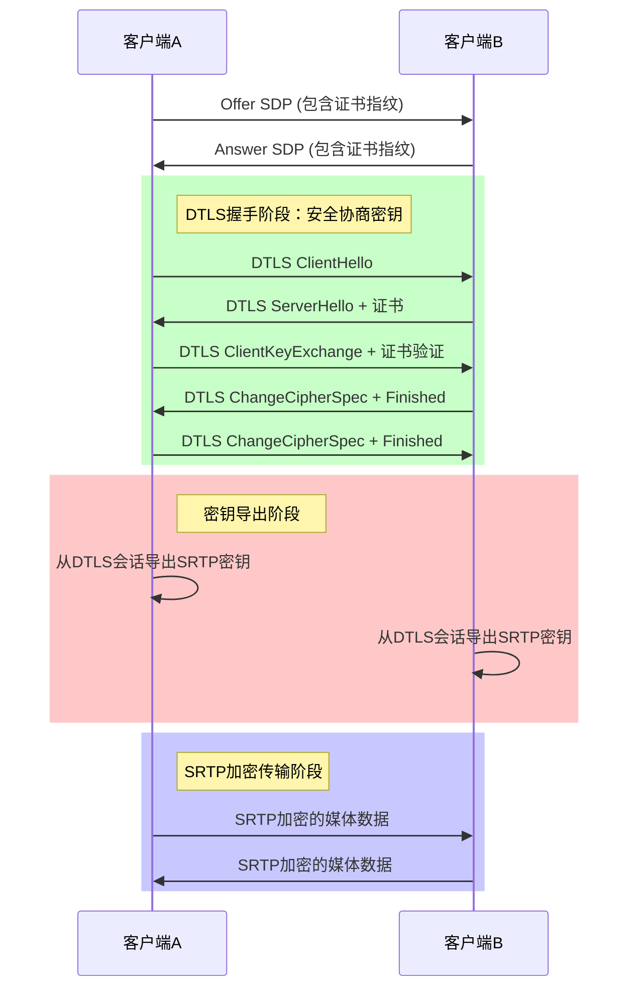

# DTLS与SRTP的关系：为什么需要两者配合使用

## 1. 核心问题：SRTP的密钥从哪里来？

SRTP（Secure RTP）确实是用来加密媒体数据的，但它本身**不提供密钥协商机制**。就像一把锁（SRTP加密算法）需要一把钥匙（加密密钥）才能工作，但SRTP本身不会告诉你如何安全地获得这把钥匙。

## 2. DTLS的角色：安全的密钥配送员

DTLS（Datagram TLS）的核心作用就是**安全地协商和配送SRTP所需的加密密钥**。它就像一个受信任的配送员，确保密钥从一方安全地送到另一方，而不会被中间人窃取或篡改。

## 3. 项目中的具体实现流程

从项目的`dtls_implementation_summary.md`文件中，我们可以看到完整的DTLS-SRTP工作流程：

### 3.1 SRTP密钥的生成过程

```cpp
void DtlsSession::GenSrtpKeys(SRtpSessionCryptoSuite crypto_suite) {
    // 1. 从SSL会话导出密钥材料
    SSL_export_keying_material(
        ssl_, srtpMaterial, srtpMasterLength * 2, 
        "EXTRACTOR-dtls_srtp", 19, nullptr, 0, 0);
    
    // 2. 根据角色分配本地和远程密钥
    if (role_ == Role::ROLE_SERVER) {
        srtpRemoteKey = srtpMaterial;
        srtpLocalKey = srtpRemoteKey + srtpKeyLength;
        srtpRemoteSalt = srtpLocalKey + srtpKeyLength;
        srtpLocalSalt = srtpRemoteSalt + srtpSaltLength;
    } else {
        // 客户端角色的密钥分配...
    }
    
    // 3. 通知上层获取到的SRTP密钥
    transport_->OnDtlsTransportConnected(
        this, crypto_suite, 
        srtpLocalMasterKey, srtpMasterLength,
        srtpRemoteMasterKey, srtpMasterLength,
        remote_cert_);
}
```

### 3.2 完整的安全传输流程



## 4. 为什么不直接在SDP中传递SRTP密钥？

如果直接在SDP中传递SRTP密钥，就相当于**明文传递钥匙**，任何人截获SDP消息都能获得密钥并解密媒体数据。这完全违背了加密的目的。

而DTLS提供了以下安全保障：

1. **身份验证**：通过证书指纹确保通信双方的身份真实可靠
2. **密钥协商**：使用公钥加密技术，确保只有通信双方能获得密钥
3. **完整性保护**：防止数据在传输过程中被篡改
4. **前向保密**：即使长期私钥泄露，也不会影响过去的通信安全

## 5. 项目中的关键技术点

### 5.1 内存BIO机制

项目使用内存BIO而非直接网络BIO，这样可以更灵活地处理UDP的不可靠特性：

```cpp
// 创建内存BIO
ssl_bio_from_network_ = BIO_new(BIO_s_mem());  // 输入BIO
ssl_bio_to_network_ = BIO_new(BIO_s_mem());    // 输出BIO

// 将BIO与SSL对象关联
SSL_set_bio(ssl_, ssl_bio_from_network_, ssl_bio_to_network_);
```

### 5.2 证书指纹验证

通过SDP中的`a=fingerprint`字段验证远程证书身份：

```
a=fingerprint:sha-256 77:B0:05:EC:26:1B:9F:85:B7:83:69:0A:57:2F:55:81:9C:60:1A:F7:A6:54:CC:A7:DF:16:61:E1:F8:72:39:F0
```

### 5.3 DTLS角色协商

通过SDP中的`a=setup`字段协商DTLS连接角色：

```
// Offer中
 a=setup:actpass

// Answer中  
a=setup:passive
```

## 6. 总结：两者缺一不可

- **SRTP**：负责加密和解密媒体数据，是"锁"的功能
- **DTLS**：负责安全地交换SRTP密钥，是"配送安全钥匙"的功能

没有DTLS，SRTP就没有安全的密钥来源；没有SRTP，DTLS协商出来的密钥就没有实际用途。两者**必须配合使用**才能实现WebRTC的端到端加密通信。

## 7. 代码优化建议

从项目实现来看，DTLS-SRTP的实现已经比较完整，但有几点可以考虑优化：

1. **增加密钥轮换机制**：定期通过DTLS重新协商SRTP密钥，提高安全性
2. **完善错误处理**：增加更详细的错误日志，便于调试和问题定位
3. **优化内存管理**：考虑使用内存池减少频繁的内存分配和释放
4. **增加性能监控**：添加DTLS握手时间、密钥导出时间等性能指标监控

通过这些优化，可以进一步提高DTLS-SRTP实现的安全性、稳定性和性能。