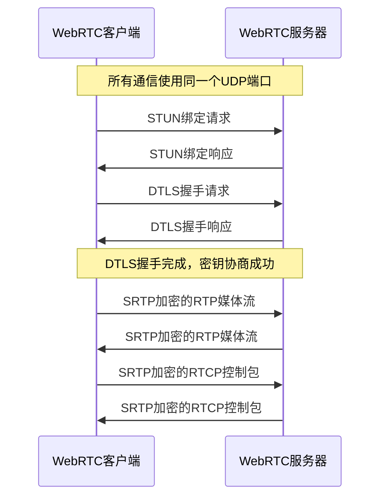

# DTLS密钥协商与WebRTC端口使用分析

## 1. 核心问题回答

**DTLS密钥协商和WebRTC媒体流（RTP/RTCP）使用的是同一个UDP端口**，而不是专门的独立端口。

## 2. 代码证据

从项目代码中可以清晰地看到这一点，特别是`WebRtcSession::HandleNoneStunPacket`方法：

```cpp
int WebRtcSession::HandleNoneStunPacket(const uint8_t* data, size_t len, UdpTransportI* trans_cb, UdpTuple addr) {
    trans_cb_ = trans_cb;  // 所有类型的数据包共享同一个传输回调
    remote_addr_ = addr;   // 所有类型的数据包来自同一个远程地址

    alive_ms_ = now_millisec();
    if (IsRtcp(data, len)) {
        LogDebugf(logger_, "Handle RTCP packet, room_id:%s, user_id:%s, session_id:%s, len:%zu",
            room_id_.c_str(), user_id_.c_str(), session_id_.c_str(), len);
        return HandleRtcpPacket(data, len, addr);
    } else if (IsRtp(data, len)) {
        LogDebugf(logger_, "Handle RTP packet, room_id:%s, user_id:%s, session_id:%s, len:%zu",
            room_id_.c_str(), user_id_.c_str(), session_id_.c_str(), len);
        return HandleRtpPacket(data, len, addr);
    } else if (DtlsSession::IsDtlsData(data, len)) {
        LogDebugf(logger_, "Handle DTLS packet, room_id:%s, user_id:%s, session_id:%s, len:%zu",
            room_id_.c_str(), user_id_.c_str(), session_id_.c_str(), len);
        dtls_session_->OnHandleDtlsData(data, len, addr);
    } else {
        LogErrorf(logger_, "Unknown none-stun packet, room_id:%s, user_id:%s, session_id:%s, len:%zu",
            room_id_.c_str(), user_id_.c_str(), session_id_.c_str(), len);
    }
    return 0;
}
```

## 3. 数据包类型识别机制

项目通过以下方式区分不同类型的数据包：

### 3.1 RTCP数据包识别
```cpp
// IsRtcp函数（未完全展示）
// 通过检查数据包的第一个字节是否在200-204范围内来识别RTCP
if (data[0] >= 200 && data[0] <= 204) {
    return true; // 这是RTCP数据包
}
```

### 3.2 RTP数据包识别
```cpp
// IsRtp函数（未完全展示）
// 通过检查RTP版本字段来识别RTP
if ((data[0] >> 6) == 2) { // RTP版本2
    return true; // 这是RTP数据包
}
```

### 3.3 DTLS数据包识别
```cpp
bool DtlsSession::IsDtlsData(const uint8_t* data, size_t len) {
    return ((len >= 13) && (data[0] > 19 && data[0] < 64));
}
```

## 4. 发送端实现

在发送端，所有类型的数据包也通过同一个UDP端口发送：

```cpp
// DTLS数据发送
void WebRtcSession::OnDtlsTransportSendData(const uint8_t* data, size_t sent_size, cpp_streamer::UdpTuple address) {
    trans_cb_->OnWriteUdpData(data, sent_size, address);
}

// RTP/RTCP数据发送
void WebRtcSession::OnTransportSendRtp(uint8_t* data, size_t sent_size) {
    // 通过同一个trans_cb_发送RTP数据
}

void WebRtcSession::OnTransportSendRtcp(uint8_t* data, size_t sent_size) {
    // 通过同一个trans_cb_发送RTCP数据  
}
```

## 5. 技术原理：WebRTC BUNDLE机制

这种设计符合WebRTC的**BUNDLE技术**标准，该技术的主要优势包括：

1. **减少端口占用**：多个媒体流和控制协议共享同一个端口
2. **简化NAT穿透**：只需要穿透一个UDP端口，提高成功率
3. **降低延迟**：减少了端口协商和连接建立的时间
4. **提高安全性**：减少了暴露在外部的端口数量

## 6. 工作流程



## 7. 总结

在RTCPilot项目中：

- **DTLS密钥协商**和**WebRTC媒体流（RTP/RTCP）**使用的是同一个UDP端口
- 系统通过检查数据包的特征来区分不同类型的数据包（RTP、RTCP、DTLS）
- 这种设计符合WebRTC的BUNDLE技术标准，具有减少端口占用、简化NAT穿透等优势
- 发送端也通过同一个UDP端口发送所有类型的数据包

这种设计是WebRTC的标准做法，能够高效地利用网络资源并提高连接建立的成功率。