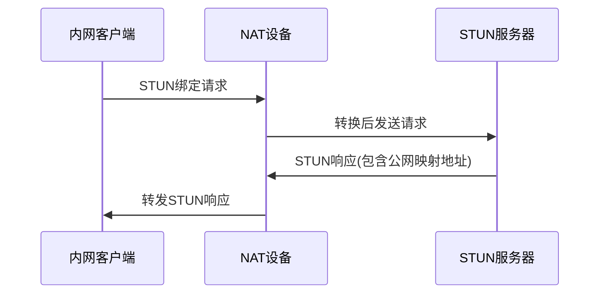
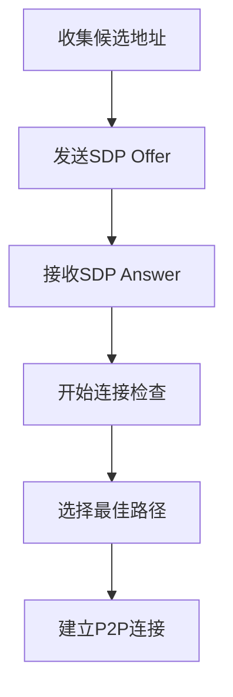
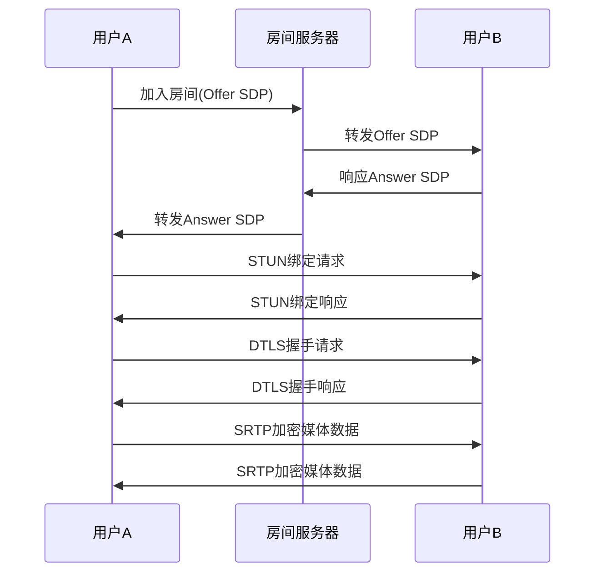
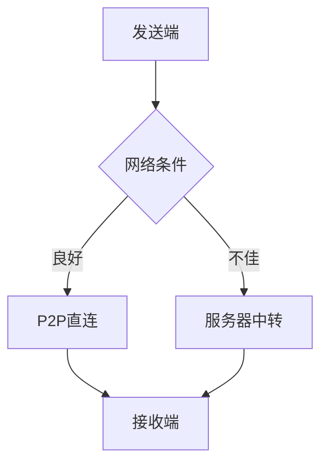
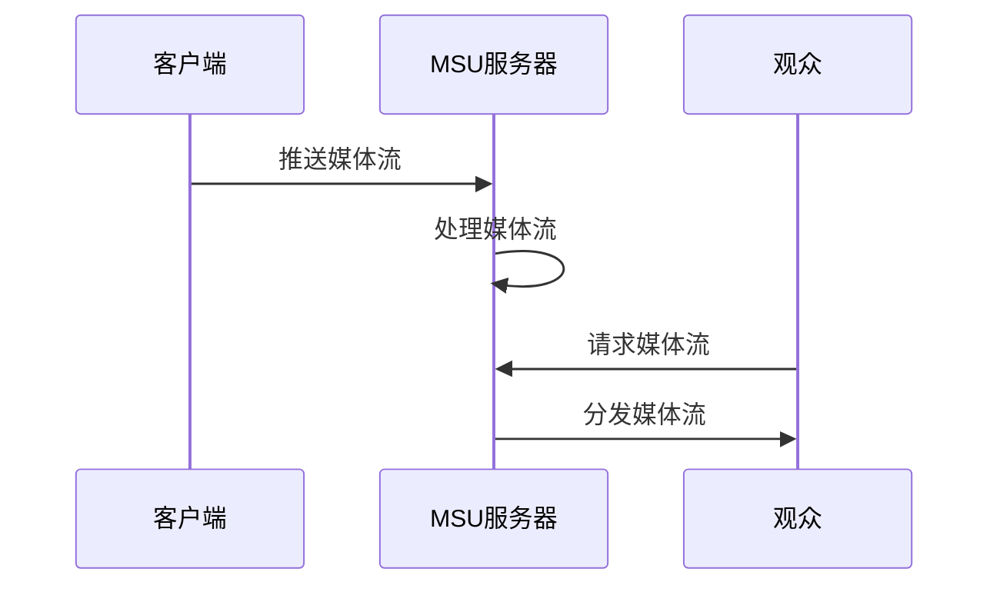

# ICE和STUN协议实现分析

## 1. ICE和STUN基本原理

### 1.1 STUN (Session Traversal Utilities for NAT)

STUN是一种用于NAT穿透的协议，主要用于获取设备在公网上的映射地址。

**核心功能：**
- 设备可以通过向STUN服务器发送请求，获取自己在公网上的IP地址和端口
- 用于检测NAT类型（如完全圆锥型、限制圆锥型、端口限制圆锥型、对称型）
- 为ICE协议提供地址信息支持

**工作流程：**


### 1.2 ICE (Interactive Connectivity Establishment)

ICE是一种用于建立可靠P2P连接的框架，它结合了STUN和TURN协议，提供了一套完整的NAT穿透解决方案。

**核心功能：**
- 收集本地地址、服务器反射地址和中继地址
- 对这些地址进行优先级排序
- 通过连接检查测试哪些地址可以成功通信
- 选择最佳的通信路径

**ICE候选地址类型：**
1. **host**：本地网络接口地址
2. **srflx**：服务器反射地址（通过STUN获取）
3. **prflx**：对等反射地址（通过P2P连接获取）
4. **relay**：中继地址（通过TURN服务器获取）

**工作流程：**


## 2. 项目中的ICE和STUN实现

### 2.1 STUN协议实现

项目在`src/net/stun/`目录下实现了STUN协议的核心功能：

**主要类和接口：**
- `StunPacket`：STUN数据包的解析和构建
- `IsStun()`：检测是否为STUN数据包
- `Parse()`：解析STUN数据包
- `Serialize()`：序列化STUN数据包
- `CreateSuccessResponse()`：创建STUN成功响应

**关键属性：**
```cpp
// STUN方法
typedef enum {
    BINDING = 1  // 绑定请求，最常用的STUN方法
} STUN_METHOD_ENUM;

// STUN属性
typedef enum {
    STUN_MAPPED_ADDRESS     = 0x0001,  // 映射地址
    STUN_XOR_MAPPED_ADDRESS = 0x0020,  // XOR映射地址
    STUN_USERNAME           = 0x0006,  // 用户名
    STUN_MESSAGE_INTEGRITY  = 0x0008,  // 消息完整性
    STUN_ERROR_CODE         = 0x0009,  // 错误代码
    STUN_REALM              = 0x0014,  // 领域
    STUN_NONCE              = 0x0015,  // 随机数
    STUN_PRIORITY           = 0x0024,  // 优先级
    STUN_USE_CANDIDATE      = 0x0025,  // 使用该候选
    STUN_ICE_CONTROLLED     = 0x8029,  // ICE受控方
    STUN_ICE_CONTROLLING    = 0x802A   // ICE控制方
} STUN_ATTRIBUTE_ENUM;
```

### 2.2 ICE服务器实现

项目在`src/webrtc_room/`目录下实现了ICE服务器功能：

**主要类和接口：**
- `IceServer`：ICE服务器的核心实现
- `HandleStunPacket()`：处理STUN绑定请求
- `GetIceUfrag()`：获取ICE用户名片段
- `GetIcePwd()`：获取ICE密码

**核心逻辑：**
```cpp
int IceServer::HandleStunPacket(StunPacket* stun_pkt, UdpTuple addr) {
    // 检查是否为绑定请求
    if (stun_pkt->stun_method_ != STUN_METHOD_ENUM::BINDING ||
        stun_pkt->stun_class_ != STUN_CLASS_ENUM::STUN_REQUEST) {
        return -1;
    }
    
    // 检查认证信息
    STUN_AUTHENTICATION ret = stun_pkt->CheckAuthentication(ice_ufrag_, ice_pwd_);
    if (ret != STUN_AUTHENTICATION::OK) {
        return -1;
    }
    
    // 创建响应并返回公网地址
    StunPacket* resp_pkt = stun_pkt->CreateSuccessResponse();
    // 设置响应参数
    // ...
    
    // 发送响应
    cb_->OnIceWrite(resp_pkt->data_, resp_pkt->data_len_, addr);
    return 0;
}
```

## 3. WebRTC会话管理

### 3.1 WebRTC会话结构

项目在`src/webrtc_room/`目录下实现了完整的WebRTC会话管理：

**主要类：**
- `WebRtcSession`：管理单个WebRTC会话
- `DtlsSession`：处理DTLS加密
- `SRtpSession`：处理SRTP媒体加密
- `MediaPusher`：媒体推送器
- `MediaPuller`：媒体拉取器

**会话初始化流程：**
```cpp
WebRtcSession::WebRtcSession(SRtpType type, const std::string& room_id, const std::string& user_id,
    PacketFromRtcPusherCallbackI* packet2room_cb,
    MediaPushPullEventI* media_push_event_cb,
    uv_loop_t* loop, Logger* logger) {
    // 初始化会话参数
    // 创建ICE服务器
    // 初始化DTLS会话
    // ...
}
```

### 3.2 媒体流处理

**媒体推送：**
```cpp
int WebRtcSession::AddPusherRtpSession(const RtpSessionParam& param, std::string& pusher_id) {
    // 创建媒体推送器
    // 配置RTP会话参数
    // ...
}
```

**媒体拉取：**
```cpp
int WebRtcSession::AddPullerRtpSession(const RtpSessionParam& param, 
    const std::string& pusher_user_id,
    const std::string& pusher_id, 
    std::string& puller_id) {
    // 创建媒体拉取器
    // 配置RTP会话参数
    // ...
}
```

## 4. P2P相关逻辑

### 4.1 P2P连接建立流程



### 4.2 媒体数据传输

**项目支持两种媒体数据传输方式：**

1. **P2P直连模式**：
   - 当网络条件允许时，媒体数据直接在用户间传输
   - 减少服务器负载
   - 降低延迟

2. **服务器中转模式**：
   - 当P2P连接失败或网络条件不佳时，通过服务器中转媒体数据
   - 提高连接成功率
   - 增加服务器负载

**数据流向：**


### 4.3 房间管理

房间管理类`Room`负责处理用户的加入、离开和媒体流的管理：

```cpp
Room::Room(const std::string& room_id, 
    PilotClientI* pilot_client,
    uv_loop_t* loop, 
    Logger* logger) {
    // 初始化房间
    // 设置定时器检测用户心跳
    // ...
}
```

## 5. MSU模式分析

### 5.1 MSU (Media Server Unit) 概念

MSU是项目中的媒体服务器单元，用于处理媒体流的转发和管理。

### 5.2 MSU模式的工作原理

**MSU模式采用**服务器中转**的方式处理媒体数据：**

1. **媒体推送**：用户将媒体流推送到MSU服务器
2. **媒体处理**：MSU服务器对媒体流进行处理（如转码、混流等）
3. **媒体分发**：MSU服务器将处理后的媒体流分发给订阅者

**工作流程：**


### 5.3 MSU与P2P模式的对比

| 特性 | P2P模式 | MSU模式 |
|------|---------|---------|
| 数据流向 | 端到端 | 客户端→服务器→客户端 |
| 服务器负载 | 低 | 高 |
| 连接成功率 | 依赖网络条件 | 高 |
| 延迟 | 低 | 较高 |
| 可扩展性 | 有限 | 好 |
| 适用场景 | 小规模通信 | 大规模直播 |

## 6. 关键接口说明

### 6.1 STUN相关接口

| 接口 | 功能 | 参数 | 返回值 |
|------|------|------|--------|
| `IsStun()` | 检测是否为STUN数据包 | data: 数据指针<br>len: 数据长度 | bool: 是否为STUN包 |
| `Parse()` | 解析STUN数据包 | data: 数据指针<br>len: 数据长度 | StunPacket*: 解析后的数据包 |
| `Serialize()` | 序列化STUN数据包 | 无 | int: 序列化结果 |
| `CheckAuthentication()` | 检查STUN认证 | ufrag: 用户名片段<br>pwd: 密码 | STUN_AUTHENTICATION: 认证结果 |

### 6.2 ICE相关接口

| 接口 | 功能 | 参数 | 返回值 |
|------|------|------|--------|
| `HandleStunPacket()` | 处理STUN数据包 | stun_pkt: STUN数据包<br>addr: 地址信息 | int: 处理结果 |
| `GetIceUfrag()` | 获取ICE用户名片段 | 无 | std::string: 用户名片段 |
| `GetIcePwd()` | 获取ICE密码 | 无 | std::string: 密码 |

### 6.3 WebRTC会话接口

| 接口 | 功能 | 参数 | 返回值 |
|------|------|------|--------|
| `DtlsInit()` | 初始化DTLS会话 | role: 角色<br>remote_fingerprint: 远程指纹 | int: 初始化结果 |
| `AddPusherRtpSession()` | 添加媒体推送会话 | param: RTP会话参数<br>pusher_id: 推送器ID | int: 操作结果 |
| `AddPullerRtpSession()` | 添加媒体拉取会话 | param: RTP会话参数<br>pusher_user_id: 推送用户ID<br>pusher_id: 推送器ID<br>puller_id: 拉取器ID | int: 操作结果 |

## 7. 总结

### 7.1 媒体数据传输方式

项目支持两种媒体数据传输方式：

1. **P2P模式**：
   - 媒体数据直接在用户间传输
   - 适用于小规模、低延迟的通信场景
   - 依赖ICE和STUN协议进行NAT穿透

2. **MSU模式**：
   - 媒体数据通过服务器中转
   - 适用于大规模、高可靠性的直播场景
   - 提供更好的可扩展性和稳定性

### 7.2 ICE和STUN的作用

- **STUN**：用于获取设备的公网映射地址，是NAT穿透的基础
- **ICE**：用于在复杂网络环境中建立可靠的P2P连接
- 两者结合使用，提供了完整的NAT穿透解决方案

### 7.3 项目架构特点

- 模块化设计，功能清晰分离
- 支持多种媒体传输模式
- 完整的WebRTC协议栈实现
- 灵活的配置和扩展能力

通过ICE和STUN协议的实现，项目能够在各种网络环境下建立可靠的通信连接，同时通过MSU模式提供了大规模媒体分发的能力，满足不同场景的需求。