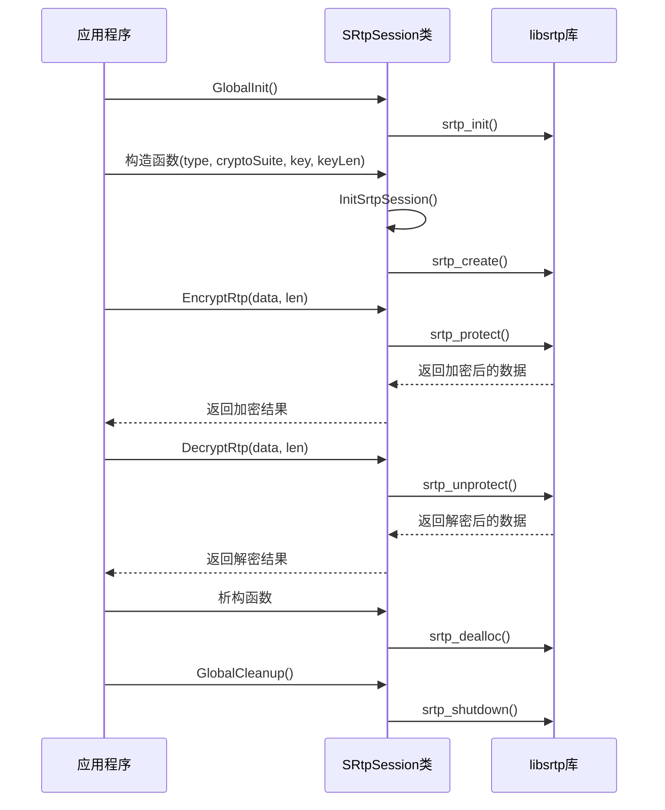
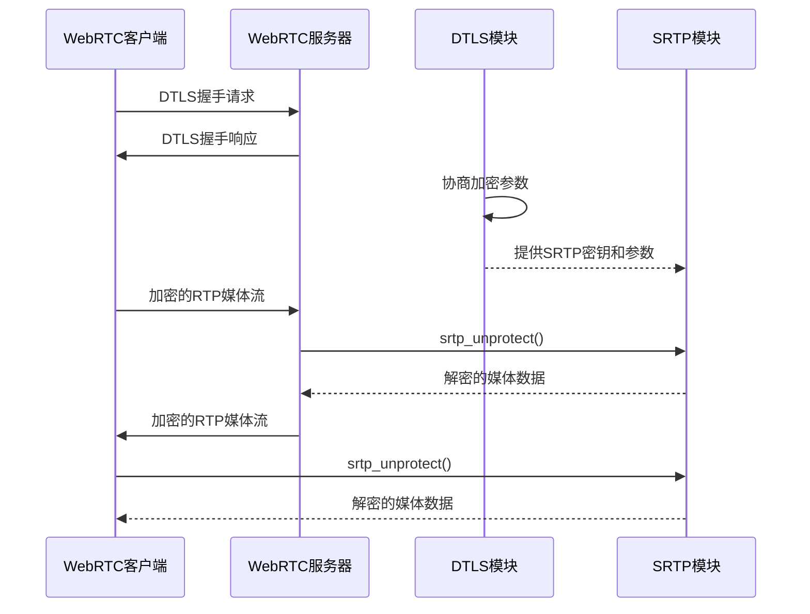

# libsrtp库使用分析

## 1. libsrtp功能概述

libsrtp是一个用于实现SRTP(Secure Real-time Transport Protocol)协议的开源库，主要功能包括：

- **RTP/RTCP加密**：对RTP和RTCP数据包进行加密保护
- **数据完整性验证**：确保传输的数据未被篡改
- **防重放保护**：防止攻击者重放捕获的数据包
- **多种加密套件支持**：支持AES-CM、AES-GCM等多种加密算法

## 2. 项目中的libsrtp接口使用

### 2.1 初始化和清理

```cpp
// 全局初始化（只需调用一次）
srtp_init();

// 全局清理
srtp_shutdown();
```

### 2.2 创建和配置SRTP会话

```cpp
// 创建SRTP策略结构体
srtp_policy_t policy;
memset(&policy, 0, sizeof(srtp_policy_t));

// 设置加密套件（根据不同加密算法）
srtp_profile_t profile = srtp_profile_aead_aes_128_gcm;
srtp_crypto_policy_set_from_profile_for_rtp(&policy.rtp, profile);
srtp_crypto_policy_set_from_profile_for_rtcp(&policy.rtcp, profile);

// 设置密钥信息
policy.key = key_;

// 设置SSRC类型（发送端/接收端）
policy.ssrc.type = ssrc_any_outbound; // 发送端
policy.ssrc.type = ssrc_any_inbound;  // 接收端

// 创建SRTP会话
srtp_create(&srtp_session_, &policy);
```

### 2.3 RTP加密/解密

```cpp
// RTP加密（发送端）
srtp_protect(srtp_session_, data_buffer_, &data_buffer_len_);

// RTP解密（接收端）
srtp_unprotect(srtp_session_, data, len);
```

### 2.4 RTCP加密/解密

```cpp
// RTCP加密（发送端）
srtp_protect_rtcp(srtp_session_, data, len);

// RTCP解密（接收端）
srtp_unprotect_rtcp(srtp_session_, data, len);
```

### 2.5 释放资源

```cpp
// 释放SRTP会话
srtp_dealloc(srtp_session_);
```

## 3. 项目中的SRtpSession类设计

项目创建了`SRtpSession`类来封装libsrtp的功能，提供了更简洁的接口：

### 3.1 主要功能

- 支持4种加密套件：
  - AEAD_AES_256_GCM
  - AEAD_AES_128_GCM
  - AES_CM_128_HMAC_SHA1_80
  - AES_CM_128_HMAC_SHA1_32

- 支持两种会话类型：
  - 发送端（SRTP_SESSION_TYPE_SEND）
  - 接收端（SRTP_SESSION_TYPE_RECV）

- 主要接口：
  ```cpp
  // 全局初始化
  static int GlobalInit();
  static void GlobalCleanup();
  
  // RTP处理
  bool EncryptRtp(uint8_t*& data, int* len);
  bool DecryptRtp(uint8_t* data, int* len);
  
  // RTCP处理
  bool EncryptRtcp(uint8_t* data, int* len);
  bool DecryptRtcp(uint8_t* data, int* len);
  ```

### 3.2 工作流程



## 4. 加密套件与密钥管理

### 4.1 加密套件配置

项目支持的加密套件配置：

| 加密套件 | 密钥长度 | 加密算法 | 完整性算法 |
|---------|---------|---------|----------|
| AEAD_AES_256_GCM | 44字节 | AES-256-GCM | AEAD (内置) |
| AEAD_AES_128_GCM | 28字节 | AES-128-GCM | AEAD (内置) |
| AES_CM_128_HMAC_SHA1_80 | 30字节 | AES-CM-128 | HMAC-SHA1 (80位) |
| AES_CM_128_HMAC_SHA1_32 | 30字节 | AES-CM-128 | HMAC-SHA1 (32位) |

### 4.2 密钥处理

- 密钥包含主密钥和盐值（master key + salt）
- 不同加密套件要求不同的密钥长度
- 密钥通常由DTLS握手过程协商产生

## 5. 与WebRTC的结合

在WebRTC中，libsrtp用于：

1. **DTLS-SRTP握手**：通过DTLS协议协商SRTP参数和密钥
2. **媒体流加密**：对音视频RTP流进行加密保护
3. **控制消息安全**：对RTCP控制消息进行加密



## 6. 关键代码位置

- **SRtpSession类定义**：`src/webrtc_room/srtp_session.hpp`
- **SRtpSession实现**：`src/webrtc_room/srtp_session.cpp`
- **全局初始化调用**：`src/RTCPilot.cpp`第83行

## 7. 使用注意事项

1. **全局初始化**：必须先调用`GlobalInit()`才能使用其他功能
2. **会话类型**：发送端和接收端需要使用不同的会话类型
3. **密钥长度**：不同加密套件要求不同的密钥长度，必须严格匹配
4. **内存管理**：加密后的数据包长度会增加，需要确保有足够的缓冲区
5. **错误处理**：必须检查libsrtp函数的返回值，及时处理错误

## 8. 代码优化建议

1. **密钥安全**：考虑使用更安全的密钥管理方式，避免明文存储
2. **错误恢复**：添加更完善的错误恢复机制，如会话重建
3. **性能优化**：对高频调用的加密解密函数进行性能优化
4. **配置灵活性**：允许通过配置文件调整SRTP参数，如窗口大小、重放保护等