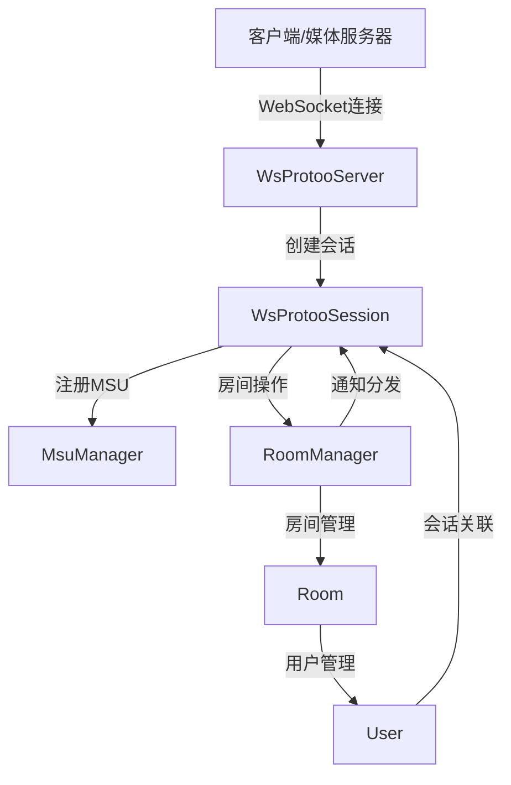
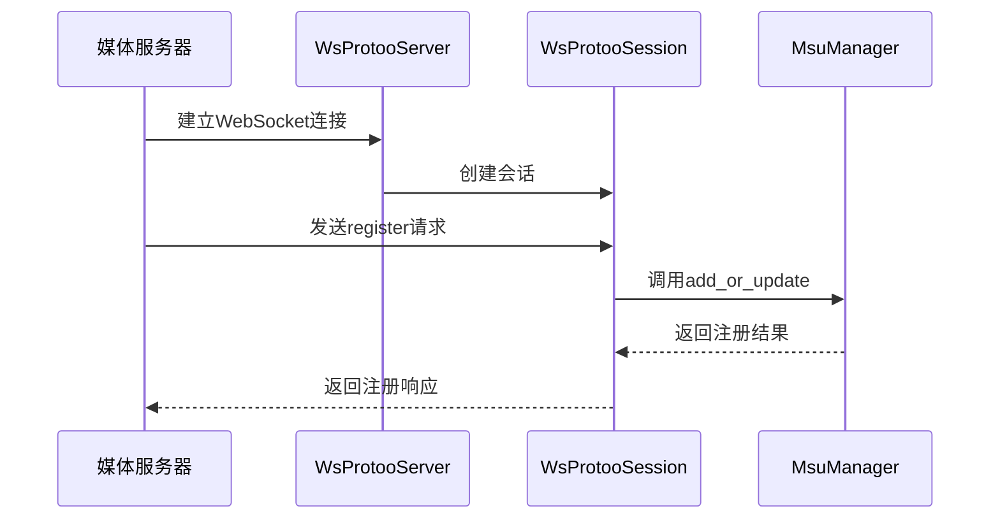
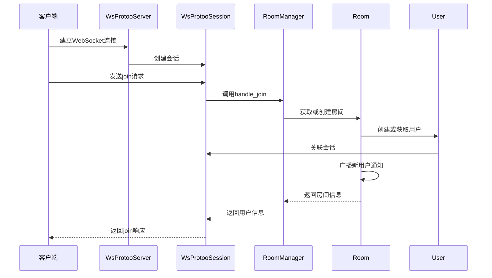
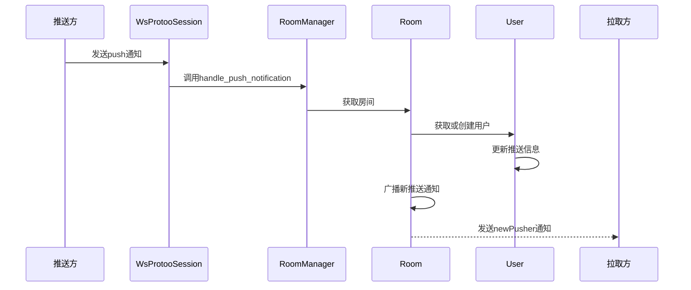
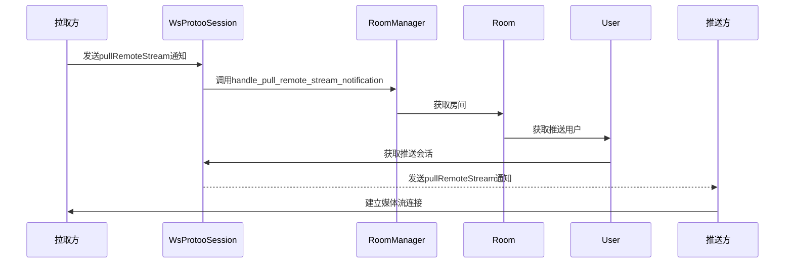
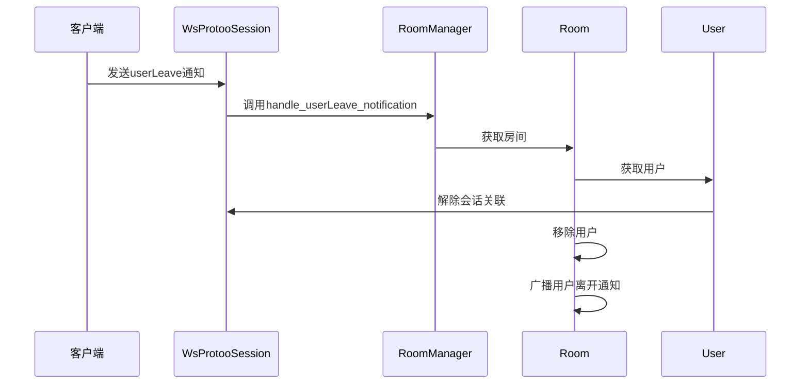

# Pilot Center 技术文档

Pilot Center 是一个基于 WebSocket 的实时通信中心，主要用于管理 WebRTC 媒体流的推送和拉取，以及房间和用户的管理。

## 1. 实现原理

### 1.1 系统架构



### 1.2 核心组件

#### 1.2.1 WebSocket 服务器 (WsProtooServer)
- 监听 WebSocket 连接，处理连接的建立和关闭
- 为每个连接创建一个 WsProtooSession 实例
- 管理所有活动会话

#### 1.2.2 WebSocket 会话 (WsProtooSession)
- 处理单个 WebSocket 连接的消息收发
- 实现 protoo 协议的消息解析和处理
- 管理请求和响应的匹配
- 维护会话与房间、用户的关联

#### 1.2.3 房间管理器 (RoomManager)
- 管理多个房间实例
- 处理房间的创建、删除和查询
- 转发房间相关的通知和请求

#### 1.2.4 房间 (Room)
- 管理房间内的用户
- 处理用户的加入、离开和状态变化
- 广播房间内的消息和通知

#### 1.2.5 用户 (User)
- 表示房间内的一个用户
- 管理用户的会话信息
- 维护用户的媒体流信息

#### 1.2.6 MSU 管理器 (MsuManager)
- 管理媒体服务器单元 (MSU) 的注册和状态
- 处理 MSU 相关的请求和通知

### 1.3 协议实现

Pilot Center 使用了类似 protoo 的 JSON 协议进行消息传递，支持三种类型的消息：

1. **请求 (Request)**：客户端向服务器发送的请求
2. **响应 (Response)**：服务器对请求的响应
3. **通知 (Notification)**：服务器或客户端发送的单向通知

## 2. 对外提供的接口协议

### 2.1 连接方式

- **WebSocket URL**：`ws://[host]:[port]/pilot/center` (HTTP)
- **WebSocket Secure URL**：`wss://[host]:[port]/pilot/center` (HTTPS)
- **默认端口**：9443

### 2.2 消息格式

#### 2.2.1 请求 (Request)

```json
{
  "request": true,
  "id": 12345678,
  "method": "method_name",
  "data": {"key": "value"}
}
```

#### 2.2.2 成功响应 (Response OK)

```json
{
  "response": true,
  "id": 12345678,
  "ok": true,
  "data": {"key": "value"}
}
```

#### 2.2.3 错误响应 (Response Error)

```json
{
  "response": true,
  "id": 12345678,
  "ok": false,
  "errorCode": 123,
  "errorReason": "Error message"
}
```

#### 2.2.4 通知 (Notification)

```json
{
  "notification": true,
  "method": "method_name",
  "data": {"key": "value"}
}
```

### 2.3 主要接口

#### 2.3.1 注册 MSU

- **请求方法**：`register`
- **请求数据**：
  ```json
  {
    "id": "msu_id"
  }
  ```
- **响应数据**：
  ```json
  {
    "registered": true,
    "msuId": "msu_id"
  }
  ```

#### 2.3.2 加入房间

- **请求方法**：`join`
- **请求数据**：
  ```json
  {
    "roomId": "room_id",
    "userId": "user_id",
    "userName": "user_name",
    "audience": false
  }
  ```
- **响应数据**：
  ```json
  {
    "code": 0,
    "message": "join success",
    "roomId": "room_id",
    "users": []
  }
  ```

#### 2.3.3 推送媒体流

- **通知方法**：`push`
- **通知数据**：
  ```json
  {
    "roomId": "room_id",
    "userId": "user_id",
    "userName": "user_name",
    "publishers": [
      {
        "pusherId": "pusher_id",
        "rtpParam": {
          "av_type": "video",
          "codec": "H264",
          "fmtp_param": "profile-level-id=42e01f;level-asymmetry-allowed=1;packetization-mode=1;",
          "ssrc": 12345678,
          "payload_type": 96,
          "clock_rate": 90000
        }
      }
    ]
  }
  ```

#### 2.3.4 拉取远程流

- **通知方法**：`pullRemoteStream`
- **通知数据**：
  ```json
  {
    "roomId": "room_id",
    "pusher_user_id": "pusher_user_id",
    "udp_ip": "192.168.1.4",
    "udp_port": 10001,
    "mediaType": "video",
    "pushInfo": {
      "pusherId": "pusher_id",
      "rtpParam": {
        "av_type": "video",
        "codec": "H264",
        "fmtp_param": "profile-level-id=42e01f;level-asymmetry-allowed=1;packetization-mode=1;",
        "ssrc": 12345678,
        "payload_type": 96,
        "clock_rate": 90000
      }
    }
  }
  ```

#### 2.3.5 用户断开连接

- **通知方法**：`userDisconnect`
- **通知数据**：
  ```json
  {
    "roomId": "room_id",
    "userId": "user_id"
  }
  ```

#### 2.3.6 用户离开房间

- **通知方法**：`userLeave`
- **通知数据**：
  ```json
  {
    "roomId": "room_id",
    "userId": "user_id"
  }
  ```

#### 2.3.7 发送文本消息

- **通知方法**：`textMessage`
- **通知数据**：
  ```json
  {
    "roomId": "room_id",
    "userId": "user_id",
    "userName": "user_name",
    "message": "Hello, world!"
  }
  ```

## 3. 业务使用的时序逻辑

### 3.1 MSU 注册时序



### 3.2 用户加入房间时序



### 3.3 媒体流推送时序



### 3.4 媒体流拉取时序



### 3.5 用户离开房间时序



## 4. 配置文件

Pilot Center 使用 YAML 格式的配置文件，示例配置如下：

```yaml
# websocket protoo center service
# all webrtc sfu will connect to this center service to report user and stream info
websocket:
  listen_ip: "0.0.0.0"
  listen_port: 9443
  cert_path: "../RTCPilot/certificate.crt"
  key_path: "../RTCPilot/private.key"
```

## 5. 运行方式

```bash
python pilot_center.py center.yaml
```

### 5.1 命令行参数

- `config`：配置文件路径
- `-v, --verbose`：增加日志详细程度
- `--log-file`：日志文件路径
- `--log-level`：日志级别 (DEBUG, INFO, WARNING, ERROR, CRITICAL)
- `--no-console`：禁用控制台日志输出

## 6. 典型使用场景

### 6.1 视频会议

1. 多个用户加入同一个房间
2. 每个用户推送自己的视频和音频流
3. 其他用户拉取所需的流进行播放
4. 用户可以发送文本消息进行交流

### 6.2 直播场景

1. 主播加入房间并推送视频流
2. 观众加入房间作为听众
3. 观众拉取主播的视频流进行观看
4. 支持主播和观众之间的文本互动

### 6.3 媒体服务器集群

1. 多个媒体服务器注册到 Pilot Center
2. 用户可以连接到任意媒体服务器
3. 媒体服务器之间通过 Pilot Center 进行流的转发和控制
4. 实现负载均衡和高可用性

## 7. 注意事项

1. Pilot Center 采用单会话模型，一个用户在一个房间内只能有一个活动会话
2. 所有消息采用异步处理，确保系统的高并发性能
3. 支持 TLS 加密，确保通信安全
4. 提供完善的日志功能，便于问题排查和系统监控

## 8. 扩展建议

1. 增加用户认证和授权机制
2. 实现房间权限管理
3. 支持媒体流的录制和回放
4. 增加统计和监控功能
5. 支持集群部署，提高系统的可扩展性
