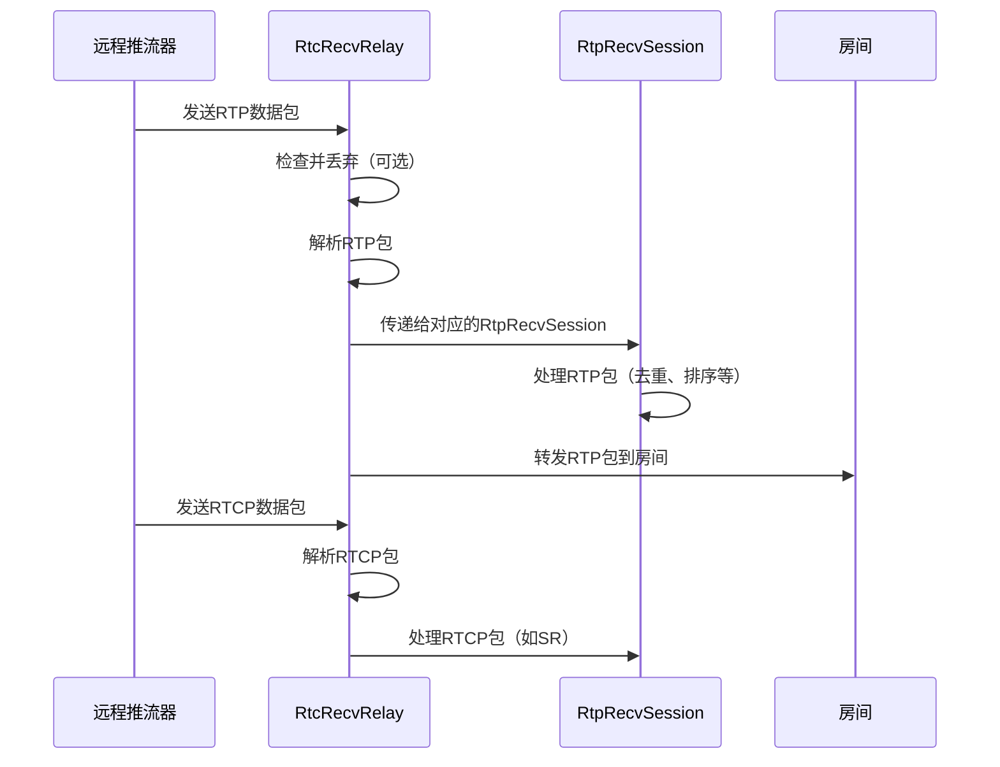
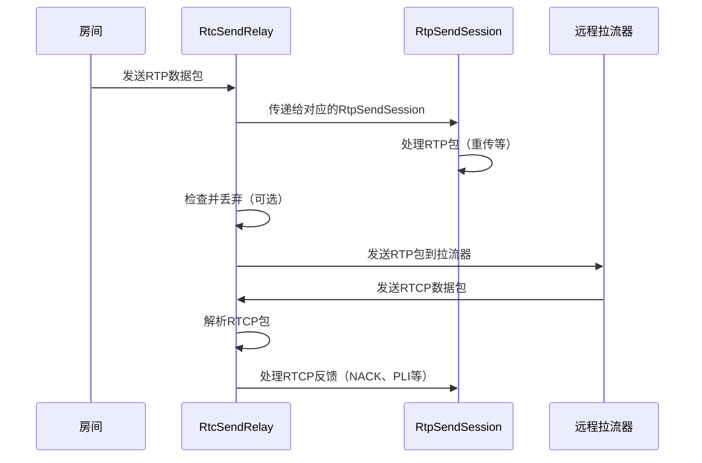
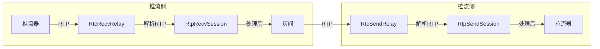
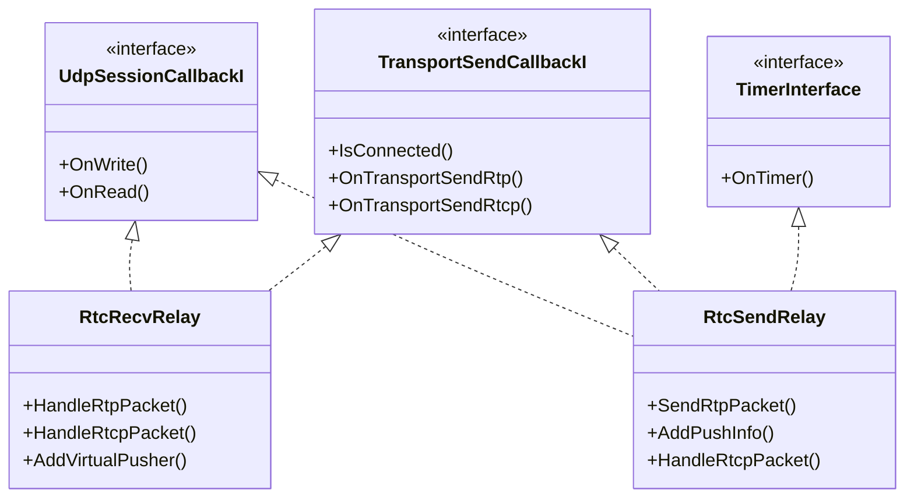
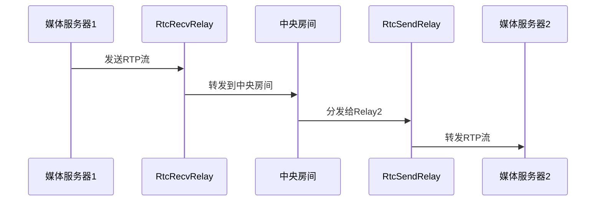
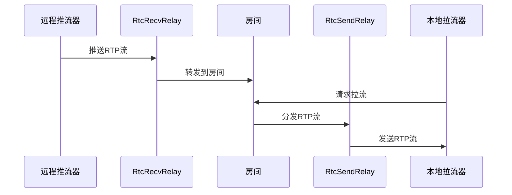

# RTC Relay 实现文档

## 1. 概述

RTC Relay是RTCPilot系统中的媒体转发模块，负责在媒体服务器单元(MSU)之间或MSU与客户端之间转发实时媒体流(RTP/RTCP)。该模块包含两个核心组件：

- **RtcRecvRelay**：负责接收远程推流器的媒体流
- **RtcSendRelay**：负责向远程拉流器发送媒体流

## 2. 系统架构

```mermaid
flowchart TD
    A[推流器/客户端] -->|RTP/RTCP| B[RtcRecvRelay]
    B -->|转发RTP| C[房间(Room)]
    C -->|拉取RTP| D[RtcSendRelay]
    D -->|RTP/RTCP| E[拉流器/客户端]
    
    subgraph Relay模块
    B
    D
    end
    
    subgraph 核心逻辑
    C
    end
```

## 3. RtcRecvRelay 实现

### 3.1 核心功能

RtcRecvRelay负责从远程推流器接收RTP/RTCP数据包，进行解析和处理后，转发到对应的房间。

### 3.2 关键接口

```cpp
// 构造函数：创建RTC接收relay实例
RtcRecvRelay(const std::string& room_id, const std::string& pusher_user_id,
    PacketFromRtcPusherCallbackI* packet2room_cb,
    uv_loop_t* loop, Logger* logger);

// 添加虚拟推流器信息
int AddVirtualPusher(const PushInfo& push_info);

// 处理接收到的RTP数据包
void HandleRtpPacket(const uint8_t* data, size_t data_size, UdpTuple address);

// 处理接收到的RTCP数据包
void HandleRtcpPacket(const uint8_t* data, size_t data_size, UdpTuple address);

// 请求关键帧
void RequestKeyFrame(uint32_t ssrc);

// 判断relay是否存活
bool IsAlive();
```

### 3.3 实现原理

1. **初始化**：
   - 创建UDP客户端并绑定到指定端口
   - 初始化各种映射表（ssrc2push_infos_, ssrc2recv_session_等）
   - 设置超时检测

2. **数据包处理流程**：



3. **关键技术点**：
   - 使用SSRC映射管理不同的媒体流
   - 支持RTP会话管理（去重、排序、丢包检测）
   - 实现了超时检测机制（40秒无数据则认为连接失效）
   - 支持配置数据包丢弃率（用于测试）

## 4. RtcSendRelay 实现

### 4.1 核心功能

RtcSendRelay负责从房间接收RTP数据包，进行处理后，发送到远程拉流器。

### 4.2 关键接口

```cpp
// 构造函数：创建RTC发送relay实例
RtcSendRelay(const std::string& room_id, 
    const std::string& pusher_user_id,
    const std::string& remote_ip,
    uint16_t remote_port,
    MediaPushPullEventI* media_event_cb,
    uv_loop_t* loop, Logger* logger);

// 发送RTP数据包
void SendRtpPacket(RtpPacket* rtp_packet);

// 添加推流器信息
void AddPushInfo(const PushInfo& push_info);

// 判断relay是否存活
bool IsAlive();
```

### 4.3 实现原理

1. **初始化**：
   - 创建UDP客户端并绑定到指定端口
   - 初始化各种映射表（ssrc2send_session_等）
   - 设置定时器用于会话管理
   - 设置超时检测

2. **数据包处理流程**：



3. **关键技术点**：
   - 支持RTCP反馈机制（NACK、PLI等）
   - 实现了RTP重传功能
   - 使用定时器定期处理会话状态
   - 支持配置数据包丢弃率（用于测试）

## 5. 转发机制详解

### 5.1 媒体流转发流程



### 5.2 数据结构映射

Relay模块使用多种映射表来管理媒体流：

| 映射表 | 作用 | 组件 |
|--------|------|------|
| ssrc2push_infos_ | SSRC到推流器信息的映射 | RtcRecvRelay |
| ssrc2recv_session_ | SSRC到接收会话的映射 | RtcRecvRelay |
| rtx_ssrc2recv_session_ | RTX SSRC到接收会话的映射 | RtcRecvRelay |
| ssrc2send_session_ | SSRC到发送会话的映射 | RtcSendRelay |
| rtx_ssrc2send_session_ | RTX SSRC到发送会话的映射 | RtcSendRelay |

### 5.3 RTCP反馈处理

Relay模块支持以下RTCP反馈机制：

1. **RTC_PSFB_PLI**：关键帧请求
   - 拉流器发送PLI请求
   - RtcSendRelay接收并解析
   - 触发媒体事件回调OnKeyFrameRequest
   - 最终由推流器发送关键帧

2. **RTC_RTPFB_NACK**：丢包重传请求
   - 拉流器发送NACK请求
   - RtcSendRelay接收并解析
   - 传递给对应的RtpSendSession
   - RtpSendSession从缓冲区中查找并重传丢失的数据包

3. **RTC_SR**：发送者报告
   - 推流器发送SR报告
   - RtcRecvRelay接收并解析
   - 更新RtpRecvSession中的统计信息

## 6. 代码结构

### 6.1 核心文件

| 文件名 | 功能 |
|--------|------|
| `rtc_recv_relay.hpp` | RtcRecvRelay的头文件定义 |
| `rtc_recv_relay.cpp` | RtcRecvRelay的实现 |
| `rtc_send_relay.hpp` | RtcSendRelay的头文件定义 |
| `rtc_send_relay.cpp` | RtcSendRelay的实现 |

### 6.2 关键类关系



## 7. 配置与依赖

### 7.1 配置参数

Relay模块的配置参数来自配置文件，主要包括：

| 参数 | 描述 | 默认值 |
|------|------|--------|
| relay_server_ip_ | Relay服务器IP | 无默认值 |
| recv_discard_percent_ | 接收数据包丢弃率 | 0 |
| send_discard_percent_ | 发送数据包丢弃率 | 0 |

### 7.2 依赖组件

- **UDP客户端**：用于收发RTP/RTCP数据包
- **RTP/RTCP解析库**：用于解析和构建RTP/RTCP数据包
- **定时器**：用于会话管理和超时检测
- **日志系统**：用于记录运行状态和错误信息

## 8. 性能与优化

### 8.1 性能特点

- 基于UDP协议，减少传输延迟
- 支持批量处理RTP/RTCP数据包
- 实现了高效的内存管理（智能指针）
- 支持配置数据包丢弃率，用于性能测试

### 8.2 优化建议

1. **增加并发处理**：可以考虑使用多线程处理不同的媒体流
2. **优化内存分配**：使用内存池减少频繁的内存分配和释放
3. **增加流量控制**：实现基于带宽的流量控制机制
4. **优化映射表查询**：使用更高效的数据结构（如哈希表）替代map

## 9. 典型场景

### 9.1 媒体服务器间转发



### 9.2 客户端拉取远程流



## 10. 错误处理与日志

### 10.1 错误处理

- **数据包解析错误**：记录错误日志并丢弃无效包
- **超时检测**：定期检查连接状态，超过40秒无数据则认为连接失效
- **资源分配失败**：记录错误日志并返回错误码

### 10.2 日志

Relay模块使用系统日志记录以下信息：

- 模块初始化和销毁
- 接收到的RTP/RTCP数据包信息
- 错误和异常信息
- 配置参数信息

## 11. 总结

RTC Relay模块是RTCPilot系统中实现媒体流转发的核心组件，通过RtcRecvRelay和RtcSendRelay两个核心类，实现了高效、可靠的媒体流转发功能。该模块支持RTP/RTCP协议，实现了RTCP反馈机制，具有良好的性能和可扩展性，适用于大规模的实时媒体流转发场景。