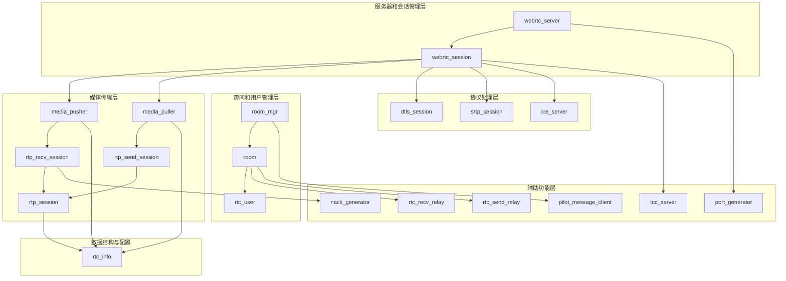
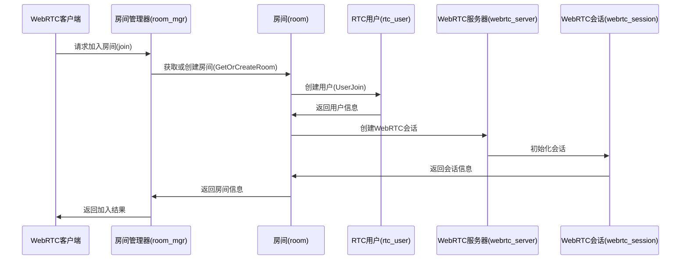
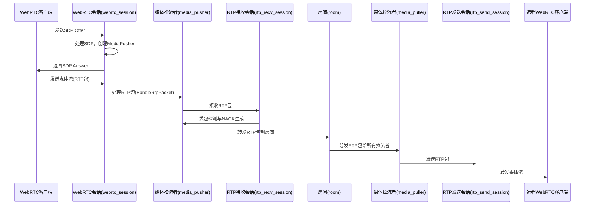
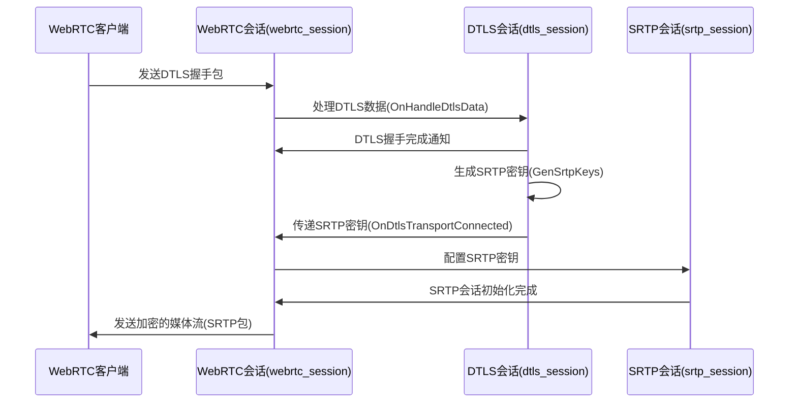

# WebRTC Room 模块说明

WebRTC Room模块是RTCPilot项目的核心组件，负责处理WebRTC会话管理、房间管理、媒体流传输和协议处理等功能。

## 文件结构与用途

### 1. 服务器和会话管理层

| 文件名 | 用途 |
| ---- | ---- |
| `webrtc_server.hpp` / `webrtc_server.cpp` | WebRTC服务器主类，负责UDP数据接收与分发，STUN/DTLS/RTP/RTCP协议处理，会话管理等核心功能。 |
| `webrtc_session.hpp` / `webrtc_session.cpp` | WebRTC会话类，管理单个WebRTC连接的完整生命周期，包括ICE、DTLS、SRTP等协议的处理，媒体流的收发。 |

### 2. 房间和用户管理层

| 文件名 | 用途 |
| ---- | ---- |
| `room_mgr.hpp` / `room_mgr.cpp` | 房间管理器，单例模式，负责房间的创建、管理和销毁，处理用户的加入和离开请求。 |
| `room.hpp` / `room.cpp` | 房间类，管理单个房间内的用户、推流者和拉流者，处理媒体流的转发和事件通知。 |
| `rtc_user.hpp` / `rtc_user.cpp` | RTC用户类，管理用户的基本信息、推流信息和心跳状态。 |

### 3. 媒体传输层

| 文件名 | 用途 |
| ---- | ---- |
| `media_pusher.hpp` / `media_pusher.cpp` | 媒体推流者类，负责处理从WebRTC客户端推送过来的媒体流。 |
| `media_puller.hpp` / `media_puller.cpp` | 媒体拉流者类，负责将媒体流推送给请求拉流的WebRTC客户端。 |
| `rtp_session.hpp` / `rtp_session.cpp` | RTP会话基类，提供RTP包序号管理、抖动计算等基础功能。 |
| `rtp_send_session.hpp` / `rtp_send_session.cpp` | RTP发送会话类，负责RTP包的发送和重传管理。 |
| `rtp_recv_session.hpp` / `rtp_recv_session.cpp` | RTP接收会话类，负责RTP包的接收、丢包检测和NACK生成。 |

### 4. 协议处理层

| 文件名 | 用途 |
| ---- | ---- |
| `dtls_session.hpp` / `dtls_session.cpp` | DTLS会话类，负责DTLS握手和密钥协商，为SRTP提供加密密钥。 |
| `srtp_session.hpp` / `srtp_session.cpp` | SRTP会话类，负责RTP/RTCP媒体流的加密和解密。 |
| `ice_server.hpp` / `ice_server.cpp` | ICE服务器类，负责ICE候选者的收集和连接建立。 |

### 5. 辅助功能层

| 文件名 | 用途 |
| ---- | ---- |
| `rtc_recv_relay.hpp` / `rtc_recv_relay.cpp` | RTC接收中继类，负责从其他服务器接收媒体流。 |
| `rtc_send_relay.hpp` / `rtc_send_relay.cpp` | RTC发送中继类，负责将媒体流发送到其他服务器。 |
| `nack_generator.hpp` / `nack_generator.cpp` | NACK生成器类，负责检测丢包并生成NACK请求。 |
| `port_generator.hpp` / `port_generator.cpp` | 端口生成器类，负责生成可用的UDP端口。 |
| `tcc_server.hpp` / `tcc_server.cpp` | TCC（Transport Congestion Control）服务器类，负责传输拥塞控制。 |
| `udp_transport.hpp` | UDP传输接口类，定义了UDP数据收发的回调接口。 |
| `pilot_message_client.hpp` / `pilot_message_client.cpp` | Pilot消息客户端类，负责与Pilot Center进行通信。 |

### 6. 数据结构与配置

| 文件名 | 用途 |
| ---- | ---- |
| `rtc_info.hpp` | 定义了RTC相关的数据结构，如RtpSessionParam、RtcCandidate等。 |
| `offer_sdp_example.txt` | SDP Offer示例文件。 |
| `answer_sdp_example.txt` | SDP Answer示例文件。 |
| `sdp.md` | SDP协议相关说明文档。 |

## 层次关系图



## 核心工作流程

### 1. 房间创建与用户加入流程



### 2. 媒体推流流程



### 3. DTLS握手与SRTP密钥协商流程



## 核心接口说明

### 1. WebRtcServer 核心接口

```cpp
// 创建WebRtcServer实例
WebRtcServer(uv_loop_t* loop, Logger* logger, const RtcCandidate& config);

// 处理STUN数据包
void HandleStunPacket(const uint8_t* data, size_t len, UdpTuple addr);

// 处理非STUN数据包(DTLS/RTP/RTCP)
void HandleNoneStunPacket(const uint8_t* data, size_t len, UdpTuple addr);
```

### 2. WebRtcSession 核心接口

```cpp
// 创建WebRtcSession实例
WebRtcSession(SRtpType type, const std::string& room_id, const std::string& user_id,
    PacketFromRtcPusherCallbackI* packet2room_cb,
    MediaPushPullEventI* media_push_event_cb,
    uv_loop_t* loop, Logger* logger);

// 初始化DTLS会话
int DtlsInit(Role role, const std::string& remote_fingerprint);

// 处理RTP数据包
int HandleRtpPacket(const uint8_t* data, size_t len, UdpTuple addr);

// 处理RTCP数据包
int HandleRtcpPacket(const uint8_t* data, size_t len, UdpTuple addr);
```

### 3. Room 核心接口

```cpp
// 创建Room实例
Room(const std::string& room_id, PilotClientI* pilot_client, uv_loop_t* loop, Logger* logger);

// 用户加入房间
int UserJoin(const std::string& user_id, const std::string& user_name, int id, ProtooResponseI* resp_cb);

// 用户离开房间
int UserLeave(const std::string& user_id);

// 处理推流SDP
int HandlePushSdp(const std::string& user_id, const std::string& sdp_type, const std::string& sdp_str, int id, ProtooResponseI* resp_cb);

// 处理拉流SDP
int HandlePullSdp(const PullRequestInfo& pull_info, const std::string& sdp_type, const std::string& sdp_str, int id, ProtooResponseI* resp_cb);
```

## 配置说明

WebRTC Room模块的配置主要通过RTCPilot项目的主配置文件`config.yaml`进行设置，包括:

- STUN/TURN服务器配置
- 媒体流加密参数
- 网络质量模拟参数(`downlink_discard_percent`和`uplink_discard_percent`)
- 端口范围配置

详细配置说明请参考项目根目录下的`config.yaml`文件。

## 总结

WebRTC Room模块是RTCPilot项目的核心组件，它实现了完整的WebRTC通信功能，包括:

1. 房间和用户管理
2. WebRTC会话建立与管理
3. STUN/ICE协议处理
4. DTLS握手与SRTP密钥协商
5. RTP/RTCP媒体流传输与控制
6. 媒体流的推拉与转发
7. 网络质量模拟与控制

该模块采用了分层设计，各组件之间职责清晰，便于维护和扩展。