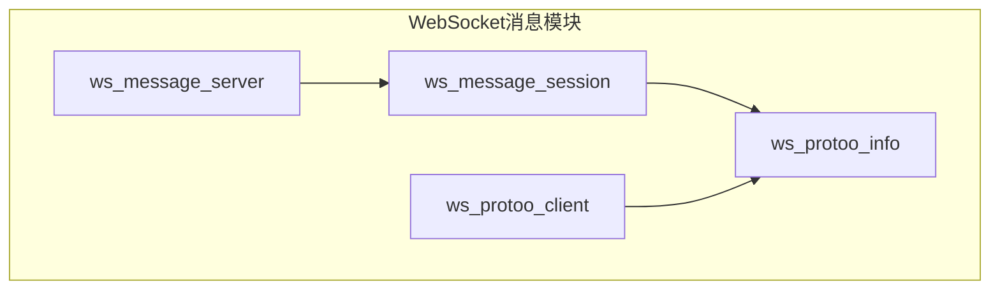
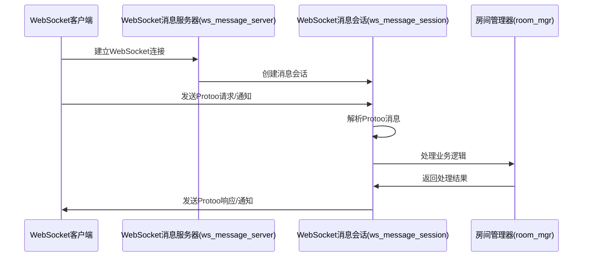
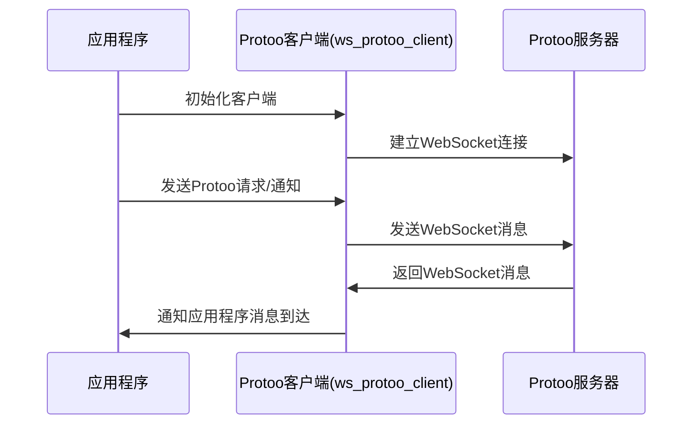

# WebSocket Message 模块说明

WebSocket Message模块是RTCPilot项目的WebSocket消息通信组件，实现了基于Protoo协议的客户端-服务器通信机制。

## 文件结构与用途

| 文件名 | 用途 |
| ---- | ---- |
| `ws_message_server.hpp` / `ws_message_server.cpp` | WebSocket消息服务器类，负责创建和管理WebSocket连接，处理客户端的连接请求。 |
| `ws_message_session.hpp` / `ws_message_session.cpp` | WebSocket消息会话类，处理单个WebSocket连接的消息收发，实现Protoo协议的解析和处理。 |
| `ws_protoo_info.hpp` | Protoo协议相关的数据结构和接口定义，包括请求、响应、通知等消息类型的定义。 |
| `ws_protoo_client.hpp` / `ws_protoo_client.cpp` | Protoo客户端类，用于与Protoo服务器建立WebSocket连接并进行通信。 |

## 层次关系图



## 核心工作流程

### 1. 服务器消息处理流程



### 2. 客户端消息处理流程



## 核心接口说明

### 1. WsMessageServer 核心接口

```cpp
// 创建WebSocket消息服务器(非加密)
WsMessageServer(const std::string& ip, uint16_t port, uv_loop_t* loop, Logger* logger);

// 创建WebSocket消息服务器(加密)
WsMessageServer(const std::string& ip, 
    uint16_t port, 
    uv_loop_t* loop, 
    const std::string& key_file, 
    const std::string& cert_file, 
    Logger* logger);
```

### 2. WsMessageSession 核心接口

```cpp
// 创建WebSocket消息会话
WsMessageSession(WebSocketSession* session, ProtooCallBackI* cb, Logger* logger);

// 处理WebSocket文本消息
virtual void OnReadText(int code, const std::string& text) override;

// 发送Protoo请求
virtual void Request(const std::string& method, nlohmann::json& j) override;

// 发送Protoo通知
virtual void Notification(const std::string& method, nlohmann::json& j) override;
```

### 3. WsProtooClient 核心接口

```cpp
// 创建Protoo客户端
WsProtooClient(uv_loop_t* loop,
               const std::string& hostname,
               uint16_t port,
               const std::string& subpath,
               bool ssl_enable,
               Logger* logger,
               WsProtooClientCallbackI* cb = nullptr);

// 异步连接到服务器
void AsyncConnect();

// 发送Protoo请求
void SendRequest(uint64_t id, const std::string& method, const std::string& data_json);
```

## Protoo协议说明

Protoo是一个简单的WebRTC信令协议，支持三种消息类型：

1. **Request（请求）**：客户端向服务器发送请求，服务器返回响应
   ```json
   {
     "request": true,
     "id": 12345,
     "method": "join",
     "data": {"roomId": "room123", "userId": "user456"}
   }
   ```

2. **Response（响应）**：服务器对客户端请求的响应
   ```json
   {
     "id": 12345,
     "response": true,
     "ok": true,
     "data": {"roomId": "room123", "userId": "user456"}
   }
   ```

3. **Notification（通知）**：服务器向客户端发送通知，不需要客户端响应
   ```json
   {
     "notification": true,
     "method": "userJoined",
     "data": {"roomId": "room123", "userId": "user789"}
   }
   ```

## 客户端请求类型

客户端主要发送以下几种Protoo请求：

### 1. join（加入房间请求）

用于用户加入指定房间。

```json
{
  "request": true,
  "id": 12345,
  "method": "join",
  "data": {
    "roomId": "room123",
    "userId": "user456",
    "userName": "张三"
  }
}
```

**字段说明**：
- `request`：布尔值，固定为true，表示这是一个请求
- `id`：整数，请求的唯一标识符
- `method`：字符串，请求方法名称，固定为"join"
- `data`：对象，请求参数
  - `roomId`：字符串，房间ID
  - `userId`：字符串，用户ID
  - `userName`：字符串，用户名

### 2. push（发布流请求）

用于客户端发布媒体流。

```json
{
  "request": true,
  "id": 12346,
  "method": "push",
  "data": {
    "userId": "user456",
    "roomId": "room123",
    "sdp": {
      "type": "offer",
      "sdp": "v=0\r\no=- 1234567890 1234567890 IN IP4 192.168.1.100\r\ns=..."
    }
  }
}
```

**字段说明**：
- `request`：布尔值，固定为true，表示这是一个请求
- `id`：整数，请求的唯一标识符
- `method`：字符串，请求方法名称，固定为"push"
- `data`：对象，请求参数
  - `userId`：字符串，用户ID
  - `roomId`：字符串，房间ID
  - `sdp`：对象，SDP媒体描述
    - `type`：字符串，SDP类型，通常为"offer"
    - `sdp`：字符串，SDP内容

### 3. pull（订阅流请求）

用于客户端订阅其他用户的媒体流。

```json
{
  "request": true,
  "id": 12347,
  "method": "pull",
  "data": {
    "roomId": "room123",
    "userId": "user456",
    "targetUserId": "user789",
    "specs": [
      {
        "pusher_id": "pusher123",
        "type": "audio"
      },
      {
        "pusher_id": "pusher456",
        "type": "video"
      }
    ],
    "sdp": {
      "type": "offer",
      "sdp": "v=0\r\no=- 0123456789 0123456789 IN IP4 192.168.1.100\r\ns=..."
    }
  }
}
```

**字段说明**：
- `request`：布尔值，固定为true，表示这是一个请求
- `id`：整数，请求的唯一标识符
- `method`：字符串，请求方法名称，固定为"pull"
- `data`：对象，请求参数
  - `roomId`：字符串，房间ID
  - `userId`：字符串，用户ID（订阅者）
  - `targetUserId`：字符串，目标用户ID（发布者）
  - `specs`：数组，订阅的媒体流规格
    - `pusher_id`：字符串，发布者的流ID
    - `type`：字符串，媒体类型，"audio"或"video"
  - `sdp`：对象，SDP媒体描述
    - `type`：字符串，SDP类型，通常为"offer"
    - `sdp`：字符串，SDP内容

### 4. heartbeat（心跳请求）

用于客户端保持与服务器的连接。

```json
{
  "request": true,
  "id": 12348,
  "method": "heartbeat",
  "data": {
    "roomId": "room123",
    "userId": "user456",
    "userName": "张三",
    "time": 1766130710245
  }
}
```

**字段说明**：
- `request`：布尔值，固定为true，表示这是一个请求
- `id`：整数，请求的唯一标识符
- `method`：字符串，请求方法名称，固定为"heartbeat"
- `data`：对象，请求参数
  - `roomId`：字符串，房间ID
  - `userId`：字符串，用户ID
  - `userName`：字符串，用户名
  - `time`：整数，当前时间戳（毫秒）

## 总结

WebSocket Message模块实现了基于Protoo协议的WebSocket通信机制，为RTCPilot项目提供了客户端-服务器之间的信令通信功能。该模块支持加密和非加密的WebSocket连接，可以处理Protoo协议的请求、响应和通知消息，是整个系统信令通信的核心组件。