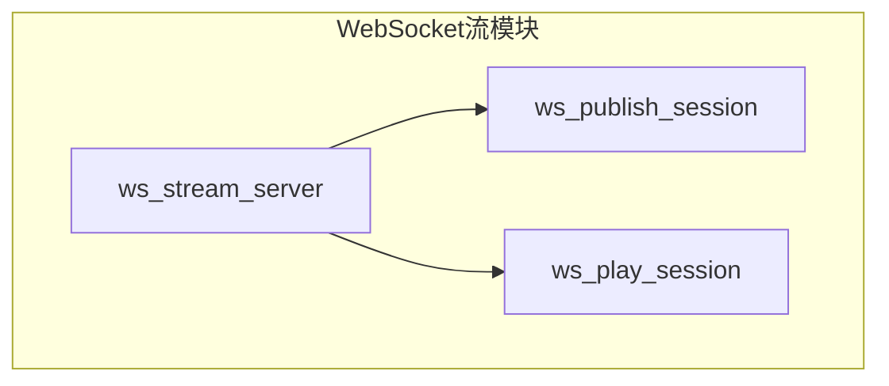
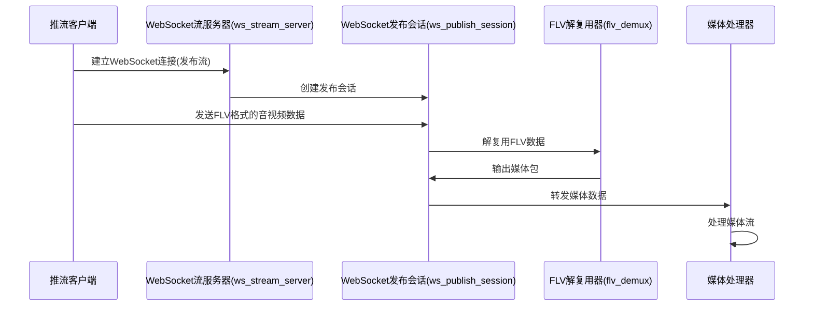
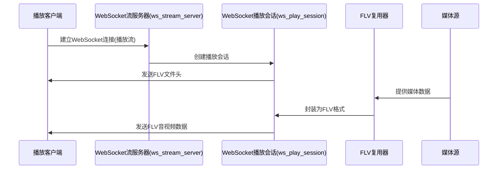

# WebSocket Stream 模块说明

WebSocket Stream模块是RTCPilot项目的WebSocket流媒体传输组件，实现了基于WebSocket的音视频流发布和播放功能。

## 文件结构与用途

| 文件名 | 用途 |
| ---- | ---- |
| `ws_stream_server.hpp` / `ws_stream_server.cpp` | WebSocket流服务器类，负责创建和管理WebSocket连接，处理客户端的发布和播放请求。 |
| `ws_publish_session.hpp` / `ws_publish_session.cpp` | WebSocket发布会话类，处理客户端发布的音视频流，将FLV格式的媒体数据解析并转发。 |
| `ws_play_session.hpp` / `ws_play_session.cpp` | WebSocket播放会话类，处理客户端的播放请求，将音视频流封装为FLV格式并发送给客户端。 |

## 层次关系图



## 核心工作流程

### 1. 流发布流程



### 2. 流播放流程



## 核心接口说明

### 1. WsStreamServer 核心接口

```cpp
// 创建WebSocket流服务器(非加密)
WsStreamServer(const std::string& ip, uint16_t port, uv_loop_t* loop, Logger* logger);

// 创建WebSocket流服务器(加密)
WsStreamServer(const std::string& ip, 
    uint16_t port, 
    uv_loop_t* loop, 
    const std::string& key_file, 
    const std::string& cert_file, 
    Logger* logger);
```

### 2. WsPublishSession 核心接口

```cpp
// 创建WebSocket发布会话
WsPublishSession(WebSocketSession* session, Logger* logger);

// 处理WebSocket数据
virtual void OnReadData(int code, const uint8_t* data, size_t len) override;

// 源数据处理接口
virtual int SourceData(Media_Packet_Ptr pkt_ptr) override;
```

### 3. WsPlaySession 核心接口

```cpp
// 创建WebSocket播放会话
WsPlaySession(WebSocketSession* session, Logger* logger);

// 处理WebSocket数据
virtual void OnReadData(int code, const uint8_t* data, size_t len) override;

// 媒体包写入接口
virtual int WritePacket(Media_Packet_Ptr) override;

// 关闭写入器
virtual void CloseWriter() override;
```

## FLV协议说明

WebSocket Stream模块使用FLV（Flash Video）格式进行音视频数据传输。FLV是一种轻量级的流媒体格式，由文件头（FLV Header）和一系列的FLV标签（FLV Tag）组成。

### FLV文件头结构

```
FLV Header (9 bytes):
+----------------+----------------+----------------+----------------+
| Signature      | Version        | Flags          | HeaderSize     |
| ("FLV", 3B)    | (1B)           | (1B)           | (4B)           |
+----------------+----------------+----------------+----------------+
```

### FLV标签结构

```
FLV Tag (Variable length):
+----------------+----------------+----------------+----------------+
| PreviousTagSize| TagType        | DataSize       | Timestamp      |
| (4B)           | (1B)           | (3B)           | (3B)           |
+----------------+----------------+----------------+----------------+
| TimestampExtended | StreamID     | TagData        |
| (1B)           | (3B)           | (Variable)     |
+----------------+----------------+----------------+
```

- TagType: 8（音频）、9（视频）、18（脚本数据）
- DataSize: 标签数据的大小
- Timestamp: 标签的时间戳
- TagData: 具体的媒体数据或脚本数据

## 总结

WebSocket Stream模块实现了基于WebSocket的音视频流传输功能，支持流的发布和播放。该模块使用FLV格式进行数据封装，通过WebSocket协议进行传输，为RTCPilot项目提供了一种灵活的流媒体传输方式。该模块支持加密和非加密的WebSocket连接，可以处理音视频流的发布和播放请求，是整个系统流媒体传输的核心组件。