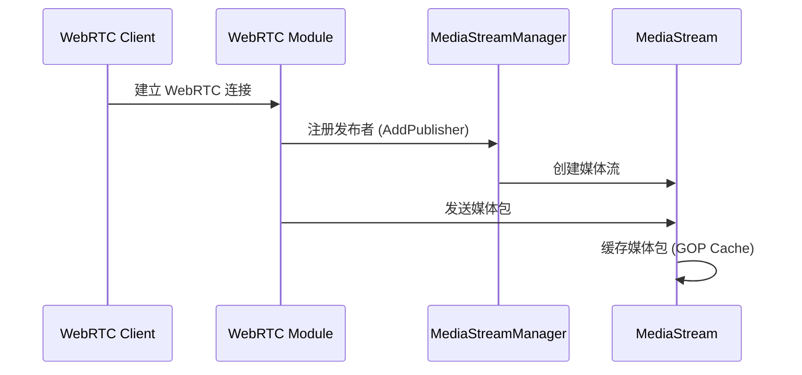
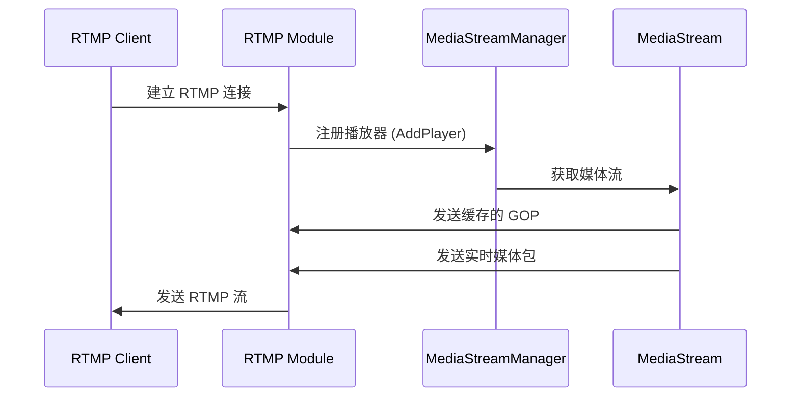
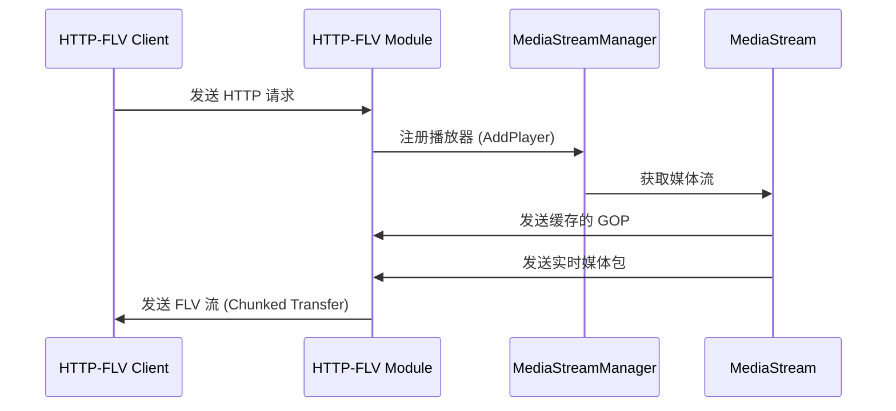

# WebRTC 推流到 RTMP/HTTP-FLV 拉流的实现原理与流程

## 1. 概述

RTCPilot 项目支持 WebRTC 推流，并将流转换为 RTMP 和 HTTP-FLV 协议，允许客户端通过多种协议拉取同一源流。本文档将详细描述这一转换过程的实现原理和工作流程。

## 2. 系统架构

项目采用模块化设计，主要包含以下几个核心模块：

- **WebRTC 模块**：处理 WebRTC 协议的推流和拉流
- **媒体流管理模块**：统一管理所有媒体流
- **RTMP 模块**：提供 RTMP 协议的服务
- **HTTP-FLV 模块**：提供 HTTP-FLV 协议的服务
- **WebSocket Stream 模块**：提供基于 WebSocket 的 FLV 流服务

## 3. 核心组件

### 3.1 媒体流管理器 (MediaStreamManager)

`MediaStreamManager` 是整个系统的核心组件，负责管理所有媒体流的发布和播放。它提供了以下主要功能：

- 管理发布者（Publisher）和播放器（Player）
- 维护媒体流的缓存（GOP Cache）
- 将媒体包分发给所有订阅者

### 3.2 媒体流 (MediaStream)

`MediaStream` 表示一个具体的媒体流，包含以下主要信息：

- 流标识（stream_key）
- 发布者状态
- GOP 缓存
- 订阅者列表

### 3.3 AvWriterInterface

`AvWriterInterface` 是一个抽象接口，所有的媒体输出（RTMP、HTTP-FLV、WebSocket Stream 等）都实现了这个接口，用于接收媒体包。

## 4. 实现原理

### 4.1 媒体流转换流程

WebRTC 推流到 RTMP/HTTP-FLV 的转换流程如下：

1. **WebRTC 推流**：客户端通过 WebRTC 协议将音视频流推送到服务器
2. **媒体包处理**：服务器接收 WebRTC 媒体包，进行解码和格式转换
3. **流注册**：将转换后的媒体流注册到 MediaStreamManager
4. **流分发**：MediaStreamManager 将媒体包分发给所有订阅者（RTMP、HTTP-FLV、WebSocket Stream 等）

### 4.2 格式转换

- **音频转换**：WebRTC 通常使用 Opus 编码，需要转换为 AAC 编码用于 RTMP/HTTP-FLV
- **视频转换**：WebRTC 通常使用 VP8/VP9/H264 编码，需要转换为 H264 编码用于 RTMP/HTTP-FLV
- **容器转换**：将 WebRTC 的 RTP 包转换为 FLV 格式的媒体包

### 4.3 流缓存机制

系统使用 GOP (Group of Pictures) 缓存机制，确保新的订阅者能够立即获取到完整的视频流信息：

- 缓存最近的一个 GOP 的所有视频帧
- 当新的订阅者加入时，先发送缓存的 GOP，然后再发送实时流
- 确保订阅者能够快速开始播放，避免花屏和卡顿

## 5. 工作流程

### 5.1 WebRTC 推流流程



### 5.2 RTMP 拉流流程



### 5.3 HTTP-FLV 拉流流程



## 6. 关键代码实现

### 6.1 媒体流注册

```cpp
// 添加发布者
MEDIA_STREAM_PTR MediaStreamManager::AddPublisher(const std::string& stream_key) {
    // 检查流是否已存在
    auto it = media_streams_map_.find(stream_key);
    if (it != media_streams_map_.end()) {
        return it->second;
    }
    
    // 创建新的媒体流
    auto stream_ptr = std::make_shared<MediaStream>(logger_);
    stream_ptr->stream_key_ = stream_key;
    stream_ptr->publisher_exist_ = true;
    
    // 保存到流映射表
    media_streams_map_[stream_key] = stream_ptr;
    
    // 通知回调
    for (auto cb : cb_vec_) {
        std::string app; 
        std::string streamname;
        if (GetAppStreamname(stream_key, app, streamname)) {
            cb->OnPublish(app, streamname);
        }
    }
    
    return stream_ptr;
}
```

### 6.2 媒体包分发

```cpp
// 写媒体包
int MediaStreamManager::WriterMediaPacket(Media_Packet_Ptr pkt_ptr) {
    const std::string& stream_key = pkt_ptr->stream_key_;
    
    // 查找媒体流
    auto it = media_streams_map_.find(stream_key);
    if (it == media_streams_map_.end()) {
        return -1;
    }
    
    MEDIA_STREAM_PTR stream_ptr = it->second;
    
    // 缓存媒体包
    stream_ptr->cache_.Append(pkt_ptr);
    
    // 分发给所有订阅者
    for (auto& writer_pair : stream_ptr->writer_map_) {
        AvWriterInterface* writer = writer_pair.second;
        writer->WritePacket(pkt_ptr);
    }
    
    // 分发给 HLS  writer
    if (hls_writer_) {
        hls_writer_->WritePacket(pkt_ptr);
    }
    
    // 分发给 RTC writer
    if (r2r_writer_) {
        r2r_writer_->WritePacket(pkt_ptr);
    }
    
    return 0;
}
```

## 7. 配置与使用

### 7.1 配置文件

在配置文件中，可以启用或禁用不同的服务：

```yaml
# RTMP 配置
rtmp:
  enable: true
  listen_ip: 0.0.0.0
  port: 1935

# HTTP-FLV 配置
httpflv:
  enable: true
  listen_ip: 0.0.0.0
  port: 8080

# WebSocket Stream 配置
ws_stream:
  enable: true
  listen_ip: 0.0.0.0
  port: 8081
```

### 7.2 使用示例

1. **WebRTC 推流**：
   - 使用支持 WebRTC 的客户端推流到服务器
   - 流地址格式：`webrtc://server-ip:port/app/streamname`

2. **RTMP 拉流**：
   - 使用 RTMP 客户端拉流
   - 流地址格式：`rtmp://server-ip:1935/app/streamname`

3. **HTTP-FLV 拉流**：
   - 使用 HTTP 客户端拉流
   - 流地址格式：`http://server-ip:8080/app/streamname.flv`

4. **WebSocket Stream 拉流**：
   - 使用 WebSocket 客户端拉流
   - 流地址格式：`ws://server-ip:8081/app/streamname.flv`

## 8. 性能优化

- **GOP 缓存**：只缓存最近的一个 GOP，减少内存占用
- **异步处理**：使用异步 I/O 处理网络连接
- **批量发送**：批量发送媒体包，减少网络开销
- **连接复用**：复用网络连接，提高并发处理能力

## 9. 总结

RTCPilot 项目通过 MediaStreamManager 实现了 WebRTC 推流到 RTMP/HTTP-FLV 的转换功能，支持多种协议的流分发。系统采用模块化设计，具有良好的可扩展性和性能。用户可以通过配置文件灵活启用或禁用不同的服务，满足不同的业务需求。
